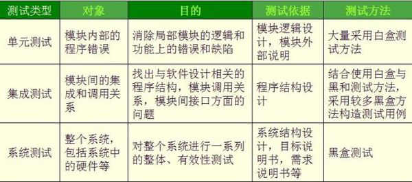

[TOC]

## 测试类型

- 单元测试
- 集成测试
- 系统测试
- 验收测试
- 回归测试
- α测试
- β测试
- λ测试
- 功能测试
- 性能测试
  - 压力测试
  - 负载测试
- 接口测试

### 单元测试

- 单元测试工具：jUnit，Mockito

- 对代码的方法级别，至多是类级别进行测试。测试力度要小，有助于定位问题

- 单元测试要遵循AIR原则
  - A：自动化，必须使用Assert验证
  - I：独立性，测试用例之间不能相互调用
  - R：可重复，每次check in时，都会执行单元测试代码。如果单测对外部环境（网络、服务、中间件）有依赖，荣耀导致持续集成机制不可用。测试时用本地（内存数据库等）实现或者Mock工具

- 语句覆盖率达70%，核心模块的语句覆盖率和分支覆盖率要达到100%
- 核心业务、核心应用、核心模块的增量代码确保通过单测。如果新增代码影响了原来的单测，及时修正
- 单元测试遵守BCDE原则，确保测试模块的交付质量
  - B：边界测试：包括循环、特殊值、数据顺序等
  - C：正确输入，得到正确结果
  - D：**与设计文档相结合，来编写单元测试**
  - E：强制错误信息输入，得到预期结果
- 对不可测的代码（私有等）做必要重构，使得代码可测，避免为了达到测试要求编写不规范的测试代码
- 在设计评审阶段，开发人员需要和测试人员一起确定单测范围，单元测试最好覆盖所有测试用例
- 单元测试作为一种质量保障手段，不建议项目发布后补充单元测试用例，建议在项目提测前完成单元测试
- 所有public方法必须被单元测试覆盖 ，只测试public 和 proctected方法 
- 随着测试覆盖率的增加，那些 public 方法的测试会覆盖到所有的路径，也包括了私有方法的调用。所以，你也不再需要测试私有方法 （TDD）
- 文件，外部Service和数据库和其他中间件的存取都必须mock掉
- 白盒测试，粒度小

### 集成测试

- 集成测试工具：**jmeter[^1]**
- 测试接口或模块之间的调用
- 粒度居中
- 测试依据：程序结构设计
- 黑盒测试较多，白盒较少

### 系统测试

- 测试整个系统，包括硬件
- 测试依据：系统结构设计，目标说明书，需求说明书等
- 黑盒测试

### 验收测试

- 验收测试是部署软件之前的最后一个测试操作 。在软件产品完成了[单元测试](https://baike.baidu.com/item/%E5%8D%95%E5%85%83%E6%B5%8B%E8%AF%95/1917084)、[集成测试](https://baike.baidu.com/item/%E9%9B%86%E6%88%90%E6%B5%8B%E8%AF%95/1924552)和[系统测试](https://baike.baidu.com/item/%E7%B3%BB%E7%BB%9F%E6%B5%8B%E8%AF%95/3073399)之后，产品发布之前所进行的[软件测试](https://baike.baidu.com/item/%E8%BD%AF%E4%BB%B6%E6%B5%8B%E8%AF%95/327953)活动。它是技术测试的最后一个阶段，也称为[交付测试](https://baike.baidu.com/item/%E4%BA%A4%E4%BB%98%E6%B5%8B%E8%AF%95/15749031)。验收测试的目的是确保软件准备就绪，并且可以让最终用户将其用于执行软件的既定功能和任务。 可能和系统测试差不多。
- 通常可以包括：安装（升级）、启动与关机、[功能测试](https://baike.baidu.com/item/%E5%8A%9F%E8%83%BD%E6%B5%8B%E8%AF%95)（正例、重要算法、边界、时序、反例、错误处理）、[性能测试](https://baike.baidu.com/item/%E6%80%A7%E8%83%BD%E6%B5%8B%E8%AF%95)（正常的负载、容量变化）、[压力测试](https://baike.baidu.com/item/%E5%8E%8B%E5%8A%9B%E6%B5%8B%E8%AF%95)（临界的负载、容量变化）、[配置测试](https://baike.baidu.com/item/%E9%85%8D%E7%BD%AE%E6%B5%8B%E8%AF%95)、平台测试、安全性测试、[恢复测试](https://baike.baidu.com/item/%E6%81%A2%E5%A4%8D%E6%B5%8B%E8%AF%95)（在出现掉电、硬件故障或切换、网络故障等情况时，系统是否能够正常运行）、[可靠性测试](https://baike.baidu.com/item/%E5%8F%AF%E9%9D%A0%E6%80%A7%E6%B5%8B%E8%AF%95)等。 
- 验收测试旨在向软件的购买者展示该软件系统满足其用户的需求。它的测试数据通常是系统测试的测试数据的子集。所不同的是，验收测试常常有软件系统的购买者代表在现场，甚至是在软件安装使用的现场。这是软件在投入使用之前的最后测试。 

### 回归测试

- 工具：jUnit

- 回归测试是指修改了旧代码后，重新进行测试以确认修改没有引入新的错误或导致其他代码产生错误。自动回归测试将大幅降低[系统测试](https://baike.baidu.com/item/%E7%B3%BB%E7%BB%9F%E6%B5%8B%E8%AF%95/3073399)、维护升级等阶段的成本。 
- 删除过时的测试用例
- 改进不受控制的测试用例
- 删除冗余的测试用例
- 增添新的测试用例

### α测试

软件测试的第一个版本（或一个模块），有公司内部人员在开发环境测试，目的是模拟真实用户的体验，注重软件界面和特色。可以有：黑盒、白盒、压力、应力等测试方法。

### β测试

 β测试是由软件的多个用户（就像网易游戏找人公测一样）在实际使用环境下进行的测试。这些用户记下遇到的所有问题，包括真实的以及主观认定的，并定期向开发者报告。

### λ测试

对个别地方做进一步优化处理即可发布。

### 功能测试

- 工具：jmeter

- 功能测试也叫[黑盒](https://baike.baidu.com/item/%E9%BB%91%E7%9B%92)测试或[数据驱动测试](https://baike.baidu.com/item/%E6%95%B0%E6%8D%AE%E9%A9%B1%E5%8A%A8%E6%B5%8B%E8%AF%95)，只需考虑需要测试的各个功能，不需要考虑整个软件的内部结构及代码 
- 一般从软件产品的界面、[架构](https://baike.baidu.com/item/%E6%9E%B6%E6%9E%84)出发，按照需求编写出来的[测试用例](https://baike.baidu.com/item/%E6%B5%8B%E8%AF%95%E7%94%A8%E4%BE%8B)，输入数据在预期结果和实际结果之间进行评测，进而提出更加使产品达到用户使用的要求 

### 性能测试

- 性能测试是通过自动化的测试工具模拟多种正常、峰值以及异常负载条件来对系统的各项性能指标进行测试 
- [负载测试](https://baike.baidu.com/item/%E8%B4%9F%E8%BD%BD%E6%B5%8B%E8%AF%95/10921210)和[压力测试](https://baike.baidu.com/item/%E5%8E%8B%E5%8A%9B%E6%B5%8B%E8%AF%95/10029152)都属于性能测试，两者可以结合进 
- [负载测试](https://baike.baidu.com/item/%E8%B4%9F%E8%BD%BD%E6%B5%8B%E8%AF%95/10921210)，确定在各种工作负载下系统的性能，**目标是测试当负载逐渐增加时，系统各项性能指标的变化情况** ，**测试的是每个点对应的性能报告**：
  - 通过量、响应时间、[CPU](https://baike.baidu.com/item/CPU)负载、内存使用 
- [压力测试](https://baike.baidu.com/item/%E5%8E%8B%E5%8A%9B%E6%B5%8B%E8%AF%95/10029152)是通过**确定一个系统的瓶颈或者不能接受的性能点**，来获得系统能提供的最大服务级别的测试 ，**测试的是一个点**

#### 负载测试

- [负载：](https://baike.baidu.com/item/%E8%B4%9F%E8%BD%BD)同时有多少个用户连接、用户上载文件大小、数据库中的记录数等都会对系统的性能有影响。一般来说，系统负载越大，系统的性能会降低 

#### 压力测试

- 压力测试是在强负载（大数据量、大量并发用户等）下的测试 
- 通过压力测试，可以知道在什么极限情况下系统会崩溃、系统是否具有自我恢复性等，但更多的是为了确定系统的稳定性
- 负载测试、压力测试是为了发现软件系统中所存在的问题，包括性能瓶颈、内存泄漏等 

## 参考资料

[α测试百度百科](https://baike.baidu.com/item/%CE%B1%E6%B5%8B%E8%AF%95/1924836?fr=aladdin)

[阿里java单元测试准则](https://blog.csdn.net/wangpengzhi19891223/article/details/79373374)

[单元测试 vs. 私有方法](https://infoq.cn/article/2009/02/unit-test-private-method)

[集成测试单元测试.系统测试,的联系和区别](https://zhidao.baidu.com/question/343525757.html)

[验收测试百度百科](https://baike.baidu.com/item/%E9%AA%8C%E6%94%B6%E6%B5%8B%E8%AF%95/10914477?fr=aladdin)

[单元测试、集成测试、系统测试、验收测试、回归测试](https://www.cnblogs.com/bkchengzheng/articles/5625949.html)

[回归测试百度百科](https://baike.baidu.com/item/%E5%9B%9E%E5%BD%92%E6%B5%8B%E8%AF%95/1925732?fr=aladdin)

[功能测试百度百科](https://baike.baidu.com/item/%E5%8A%9F%E8%83%BD%E6%B5%8B%E8%AF%95/10921202?fr=aladdin)

[功能测试方法总结](https://www.cnblogs.com/smile1313113/p/3267034.html)

[性能测试工具JMeter](http://www.51testing.com/zhuanti/jmeter.html)

[性能测试百度百科](https://baike.baidu.com/item/%E6%80%A7%E8%83%BD%E6%B5%8B%E8%AF%95/1916148?fr=aladdin)

[10 个开源的压力/负载测试工具](https://www.cnblogs.com/davygeek/p/6603425.html)

[负载测试百度百科](https://baike.baidu.com/item/%E8%B4%9F%E8%BD%BD%E6%B5%8B%E8%AF%95/10921210?fr=aladdin)

[^1]: Apache JMeter是Apache组织开发的基于Java的功能和性能测试工具 。能够对HTTP和FTP服务器进行压力和[**性能测试**](javascript:;)， 也可以对任何数据库进行同样的测试 ,完全的可移植性和100％ 纯java 