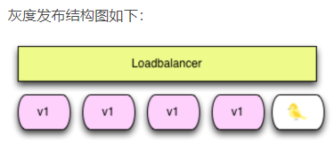

[TOC]

## 0 部署发布类型

在项目迭代的过程中，不可避免需要”上线“。上线对应着部署，或者重新部署；部署对应着修改；修改则意味着风险 ，常用的部署类型有：

- 蓝绿部署
- 滚动部署
- 灰度发布(金丝雀部署)
- 功能开关发布
- 影子测试
- AB测试

### 1 蓝绿部署

- 一共有两套系统：一套是正在提供服务系统，标记为“绿色”；另一套是准备发布的系统，标记为“蓝色” 
- 蓝色系统不对外提供服务 ，只用来作发布前的测试。 **测试过程中发现任何问题，可以直接在蓝色系统上修改**，不干扰用户正在使用的系统。（注意，两套系统没有耦合的时候才能百分百保证不干扰） 
- 蓝色系统经过反复的测试、修改、验证，确定达到上线标准之后，直接将用户切换到蓝色系统 

- 切换后的**一段时间内，依旧是蓝绿两套系统并存**，但是用户访问的已经是蓝色系统。这段时间内**观察蓝色系统（新系统）工作状态**，如果出现问题，直接切换回绿色系统 
- 当确信对外提供服务的蓝色系统工作正常，不对外提供服务的绿色系统已经不再需要的时候，蓝色系统正式成为对外提供服务系统，成为新的绿色系统。 原先的绿色系统可以销毁，将资源释放出来，用于部署下一个蓝色系统 

#### 1.1 注意事项

1. 当你切换到蓝色环境时，需要妥当处理未完成的业务和新的业务 
2. 可能会出现需要同时处理“微服务架构应用”和“传统架构应用”的情况，如果在蓝绿部署中协调不好这两者，还是有可能会导致服务停止 
3. 需要提前考虑数据库与应用部署同步迁移 /回滚的问题 
4. 蓝绿部署需要有基础设施支持 
5. 在非隔离基础架构（ VM 、 Docker 等）上执行蓝绿部署，蓝色环境和绿色环境有被摧毁的风险 
6. 如果目标系统是一组无状态的Web服务器，但是数量非常多，假设有一万台 ，就不能用蓝绿发布了，这时可以使用金丝雀发布

#### 1.2 优势

- 升级切换和回退速度非常快 

#### 1.3 不足

- 切换是全量的，如果 V2 版本有问题，则对用户体验有直接影响 
- 需要两倍机器资源 

#### 1.4 适用场景

- 对用户体验有一定容忍度的场景 
- 机器资源有富余或者可以按需分配（AWS 云，或自建容器云） 

### 2 灰度发布/金丝雀部署

- 灰度发布是指在黑与白之间，能够平滑过渡的一种发布方式 
- 让一部分用户继续用A，一部分用户开始用B，如果用户对B没有什么反对意见，那么逐步扩大范围，把所有用户都迁移到B上面来 
- 灰度发布可以保证整体系统的稳定，在初始灰度的时候就可以发现、调整问题，以保证其影响度，而我们平常所说的金丝雀部署也就是灰度发布的一种方式 
- 实际操作中还可以做更多控制，譬如说，给最初更新的10台服务器设置较低的权重、控制发送给这10台服务器的请求数，然后逐渐提高权重、增加请求数 ： **这个控制叫做“流量切分”** 
- 在整个系统只有一台服务器的时候 ，不能用金丝雀发布了

#### 2.1 优势

- 用户体验影响小，灰度发布过程出现问题只影响少量用户 

#### 2.2 不足

- 如果发布自动化程度不够，发布期间可引发服务中断 

#### 2.3 适用场景

- 资源不充足
- 用户体验要求高

### 3 滚动部署

- 一般是取出一个或者多个服务器**停止服务，执行更新**，并重新将其投入使用 ，直到集群中所有的实例都更新成新版本 
- 相对于蓝绿部署，更加节约资源——它不需要运行两个集群、两倍的实例数。我们可以部分部署，例如每次只取出集群的20%进行升级 
- 在金丝雀发布基础上的进一步优化改进，是一种自动化程度较高的发布方式，用户体验比较平滑，是目前成熟型技术组织所采用的主流发布方式 

#### 3.1 注意事项

- 没有一个确定OK的环境。使用蓝绿部署，我们能够清晰地知道老版本是OK的，而使用滚动发布，我们无法确定 
- 修改了现有的环境 
- 如果需要回滚，很困难。举个例子，在某一次发布中，我们需要更新100个实例，每次更新10个实例，每次部署需要5分钟。当滚动发布到第80个实例时，发现了问题，需要回滚，这个回滚却是一个痛苦，并且漫长的过程 
- 有的时候，我们还可能对系统进行动态伸缩，如果部署期间，系统自动扩容/缩容了，我们还需判断到底哪个节点使用的是哪个代码。尽管有一些自动化的运维工具，但是依然令人心惊胆战 
- 因为是逐步更新，那么我们在上线代码的时候，就会短暂出现新老版本不一致的情况，如果对上线要求较高的场景，那么就需要考虑如何做好兼容的问题 

#### 3.2 优势

- 用户体验影响小，体验较平滑 

#### 3.3 不足

- 发布和回退时间比较缓慢 
- 发布工具比较复杂，LB 需要平滑的流量摘除和拉入能力 

### 4 功能开关发布

- 利用代码中的功能开关（Feature Flag/Toggle/Switch）来控制发布逻辑 ，一般不需要复杂的发布工具和智能 LB 配合，是一种相对比较低成本和简单的发布方式 
- 这种方式也是支持现代 DevOps 理念，研发人员可以灵活定制和自助完成的发布方式 
- 功能开关发布需要一个配置中心或者开关中心这样的服务支持，例如携程的 Apollo 配置中心或者开源的 FF4J 
- 新功能（V2 new feature）和老功能（V1 old feature）住在同一套代码中，新功能隐藏在开关后面，如果开关没有打开，则走老代码逻辑，如果开关打开，则走新代码逻辑。技术实现上可以理解为一个简单的 if/else 逻辑 
- 应用上线后，开关先不打开，然后运维或研发人员通过开关中心打开新功能，经过流量验证新功能没有问题，则发布完成；如果有问题，则随时可以通过开关中心切回老功能逻辑 

#### 4.1 优势

- 升级切换和回退速度非常快 
- 相对于复杂的发布工具，实施比较简单，成本相对低廉 
- 研发能够灵活定制发布逻辑，支持 DevOps 自助发布 

#### 4.2 不足

- 切换是全量的，如果 V2 版本有问题，则对用户体验有直接影响 
- 对代码有侵入，代码逻辑会变复杂，需要定期清理老版本逻辑，维护成本变高 

### 5 影子测试

- 对于一些涉及核心业务的遗留系统的升级改造，为了确保万无一失，有一种称为影子测试的大招，采用比较复杂的流量复制、回放和比对技术实现 
- 影子测试一般适用于遗留系统的等价重构迁移，例如 .net 转 Java，或者 SQLServer 数据库升级为 MySQL 数据库 
- 外部依赖不能太多，否则需要开发很多 mock，测试部署成本会很高，且比对测试更加复杂和不稳定 

#### 5.1 实现A服务迁移升级到B服务

1. 测试开始前，需要在测试环境部署一份 A服务和 B服务，**同时将生产数据库复制两份到测试环境** 
2. 同时需要将生产请求日志收集起来，一般可以通过 kafka 队列收集 
3. 然后通过类似 goreplay 这样的工具，消费 kafka 里头的请求日志，复制回放，将请求分发到 A服务和 B服务，收到响应后进行比对 
4. 如果所有响应比对成功，则可以认为 A服务和 B服务在功能逻辑上是等价的 
5. 如果有响应比对失败，则认为两者在功能逻辑上不等价，需要修复 B并重新进行影子测试，直到全部比对成功 
6. 根据系统复杂度和关键性不同，比对测试时间短的可能需要几周，长的可达半年之久 

#### 5.2 优势

- 影子测试因为旁路在独立测试环境中进行，可以对生产流量完全无影响 
- 可以使用生产真实流量进行测试（复制比对） 

#### 5.3 不足

- 搭建复杂度很高，技术门槛高，数据库的导出复制是难点 
- 外部依赖不能太多，否则测试部署成本很高，且比对测试更加复杂和不稳定 

### A/B测试

- A/B测试和蓝绿部署以及金丝雀，完全是两回事 
- 蓝绿部署和金丝雀是发布策略，目标是确保新上线的系统稳定，关注的是新系统的BUG、隐患 
- A/B测试是效果测试，**同一时间有多个版本的服务对外服务**，这些服务都是经过足够测试，达到了上线标准的服务，有差异但是没有新旧之分（它们上线时可能采用了蓝绿部署的方式） 
- A/B测试时，线上同时运行多个版本的服务，这些服务通常会有一些体验上的差异，譬如说页面样式、颜色、操作流程不同。相关人员通过分析各个版本服务的实际效果，**选出效果最好的版本** 
- 在A/B测试中，需要能够控制流量的分配，譬如说，为A版本分配10%的流量，为B版本分配10%的流量，为C版本分配80%的流量 

## 参考资料

[微服务部署：蓝绿部署、滚动部署、灰度发布、金丝雀发布](https://www.cnblogs.com/williamjie/p/9497390.html)

[蓝绿部署、A/B 测试以及灰度发布](https://www.v2ex.com/t/344341)

[蓝绿部署、金丝雀发布（灰度发布）、A/B测试的准确定义](https://blog.csdn.net/lijiaocn/article/details/84276591)