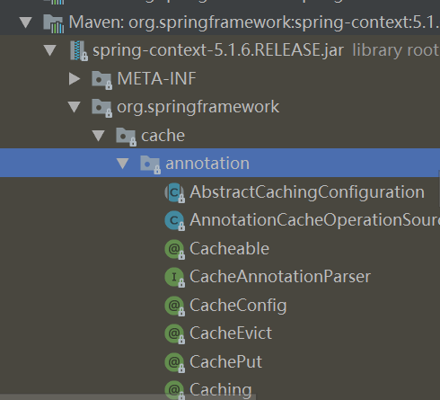

```java
@Target({ElementType.TYPE})
@Retention(RetentionPolicy.RUNTIME)
@Documented
//这里导入的是一个Selector类
//导入这个类的注解类中，有一些参数
//这些参数会被Selector类所捕获
@Import({CachingConfigurationSelector.class})
//通过Selector类，在确定需要导入的Configuration类，这样不同的注解属性可能导入的Configuration类不同
public @interface EnableCaching {
    boolean proxyTargetClass() default false;
    AdviceMode mode() default AdviceMode.PROXY;
    int order() default 2147483647;
}

@Retention(RetentionPolicy.RUNTIME)
@Target({ElementType.TYPE})
@Documented
//而这里导入的是一个Configuration类
@Import({DelegatingWebMvcConfiguration.class})
public @interface EnableWebMvc {
}
```

`Selector`类：比直接导入Configuration类要更加灵活

```java
public final String[] selectImports(AnnotationMetadata importingClassMetadata) {
    //这里就会根据importingClassMetadata中提取的注解属性
    //这样就可以根据不同的属性，加载不同的配置
}
```


这些注解（如：@EnableCacjhe、@EnableWebMvc）都是在**第三方包中自己定义的**，是中间件开启的对外的一个接口。如果要使用该中间件，就引入这个包，再使用这个注解，就可以开启中间件的功能。如下图，是spring的cache中间件，开发者使用annotation包下提供的一些注解，就能方便的使用cache中间件功能。



