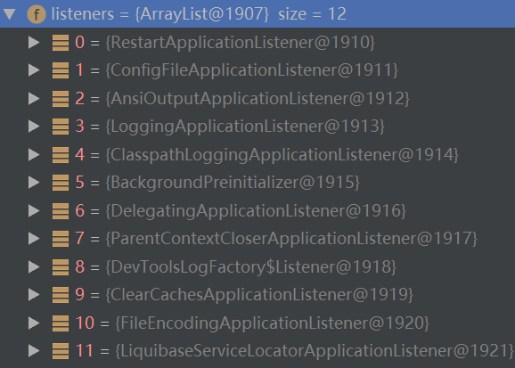
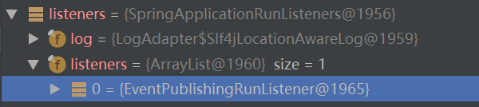

[TOC]

## 0 SpringApplication.run()

```java
SpringApplication.run(SpringbootLearnApplication.class, args);//先初始化SpringApplication类，再调用它的run方法
//第一步：初始化SpringApplication类，primarySources对应SpringbootLearnApplication.class
public SpringApplication(ResourceLoader resourceLoader, Class... primarySources) {
    this.sources = new LinkedHashSet();
    this.bannerMode = Mode.CONSOLE;//banner
    this.logStartupInfo = true;
    this.addCommandLineProperties = true;
    this.addConversionService = true;
    this.headless = true;
    this.registerShutdownHook = true;
    this.additionalProfiles = new HashSet();
    this.isCustomEnvironment = false;
    this.resourceLoader = resourceLoader;
    Assert.notNull(primarySources, "PrimarySources must not be null");
    this.primarySources = new LinkedHashSet(Arrays.asList(primarySources));
    //判断应用的类型，枚举类型：NONE,SERVLET,REACTIVE;
    this.webApplicationType = WebApplicationType.deduceFromClasspath();
    //这里就是读取所有的jar包中的META-INF/下的spring.factories文件中
    //key为ApplicationContextInitializer的值，生成一个List<String>
    //如下图initializers所示
    this.setInitializers(this.getSpringFactoriesInstances(ApplicationContextInitializer.class));
    //同理查找key为ApplicationListener
    this.setListeners(this.getSpringFactoriesInstances(ApplicationListener.class));
    //找到main函数对应的类
    this.mainApplicationClass = this.deduceMainApplicationClass();
    //# Initializers
	//org.springframework.context.ApplicationContextInitializer=\
	//org.springframework.boot.autoconfigure.SharedMetadataReaderFactoryContextInitializer,\
	//org.springframework.boot.autoconfigure.logging.ConditionEvaluationReportLoggingListener
    //# Application Listeners
    //org.springframework.context.ApplicationListener=\
	//org.springframework.boot.autoconfigure.BackgroundPreinitializer
}

//第二步：调用run方法，这个args就是main函数输入的参数
public ConfigurableApplicationContext run(String... args) {
    //记录应用启动时间
    StopWatch stopWatch = new StopWatch();
    stopWatch.start();
    
    ConfigurableApplicationContext context = null;
    Collection<SpringBootExceptionReporter> exceptionReporters = new ArrayList();
    //1 设置使用Headless，对于只有远程登录使用的服务器来说这样性能要好一些
    this.configureHeadlessProperty();
    //2 查找spring.factory中的SpringApplicationRunListeners，并创建所有的监听器
    SpringApplicationRunListeners listeners = this.getRunListeners(args);
    //3 通知所有监听器启动
    listeners.starting();

    Collection exceptionReporters;
    //args为main入口参数
    ApplicationArguments applicationArguments = new DefaultApplicationArguments(args);
    //4 查找配置文件
    ConfigurableEnvironment environment = this.prepareEnvironment(listeners, applicationArguments);
    //获取System中spring.beaninfo.ignore属性，不知道干啥的
    this.configureIgnoreBeanInfo(environment);
    //打印Spring Banner，可在resource下自定义了一个banner.txt文件
    //5 打印Banner
    Banner printedBanner = this.printBanner(environment);
    //6 根据应用的类型，创建Spring容器
    context = this.createApplicationContext();
    //7 从Spring.factories中查找这个类，用于异常路径的报错（应该就是如果异常是，可以带人context信息）
    exceptionReporters = this.getSpringFactoriesInstances(SpringBootExceptionReporter.class, new Class[]{ConfigurableApplicationContext.class}, context);
    
    //主要是调用所有初始化类的initialize方法，准备上下文资源
    //1. 将准备好的Environment设置给ApplicationContext
    //2. 遍历调用所有的ApplicationContextInitializer的initialize()方法，对已经创建的ApplicatinContext做进一步处理
    //3. 调用SpringApplicationRunListener的ContextPrepared()方法，通知所有监听者：ApplicationContext已经准备完毕
    //4. 调用SpringApplicationRunListener的contextLoaded()方法，通知所有监听者：ApplicationContext装载完毕
    //prepareContext()方法将listeners、environment、applicationArguments、banner等重要组件与上下文对象关联
    //8 准备上下文环境
    this.prepareContext(context, environment, listeners, applicationArguments, printedBanner);
    //9 加载业务bean，启动tomcat，发布对应事件
    this.refreshContext(context);
    //10 执行 Spring 容器的初始化的后置逻辑，默认实现为空
    this.afterRefresh(context, applicationArguments);
    stopWatch.stop();
    if (this.logStartupInfo) {
        (new StartupInfoLogger(this.mainApplicationClass)).logStarted(this.getApplicationLog(), stopWatch);
    }
    //11 通知监听者 Spring 容器启动完成
    listeners.started(context);
    //12 调用 ApplicationRunner 或者 CommandLineRunner 的运行方法
    this.callRunners(context, applicationArguments);
    //13 通知监听者，应用在运行
    listeners.running(context);
    return context;
}
```
### 1 configureHeadlessProperty()：远程登录使用的服务器配置

```java
//SpringApplication：设置使用Headless，对于只有远程登录使用的服务器来说这样性能要好一些
private void configureHeadlessProperty() {
    System.setProperty("java.awt.headless", System.getProperty("java.awt.headless", Boolean.toString(this.headless)));
}
```

### 2 getRunListeners()：获取spring.factory中的SpringApplicationRunListeners，并创建所有的监听器

```java
//SpringApplication：查找spring.factory中的SpringApplicationRunListeners，并创建所有的监听器
private SpringApplicationRunListeners getRunListeners(String[] args) {
    Class<?>[] types = new Class[]{SpringApplication.class, String[].class};
    return new SpringApplicationRunListeners(logger, this.getSpringFactoriesInstances(SpringApplicationRunListener.class, types, this, args));
}
```

### 3 listeners.starting()：通知所有Run监听器开始运行

```java
//SpringApplicationRunListeners：
public void starting() {
    Iterator var1 = this.listeners.iterator();
    while(var1.hasNext()) {
        SpringApplicationRunListener listener = (SpringApplicationRunListener)var1.next();
        listener.starting();
    }
}
```

### 4 prepareEnvironment()：关键是获取配置文件

```java
//SpringApplication：
private ConfigurableEnvironment prepareEnvironment(SpringApplicationRunListeners listeners, ApplicationArguments applicationArguments) {
    //根据应用类型，创建应用环境：如得到系统的参数和JVM等参数，等
    ConfigurableEnvironment environment = this.getOrCreateEnvironment();
    //创建环境并配置
    this.configureEnvironment((ConfigurableEnvironment)environment, applicationArguments.getSourceArgs());
    //4.1 
    listeners.environmentPrepared((ConfigurableEnvironment)environment);
    this.bindToSpringApplication((ConfigurableEnvironment)environment);
    if (!this.isCustomEnvironment) {
        environment = (new EnvironmentConverter(this.getClassLoader())).convertEnvironmentIfNecessary((ConfigurableEnvironment)environment, this.deduceEnvironmentClass());
    }

    ConfigurationPropertySources.attach((Environment)environment);
    return (ConfigurableEnvironment)environment;
}
```
#### 4.1 listeners.environmentPrepared(）：Run监听器准备配置环境

- 运行监听器中的环境配置类，重要的是ConfigFileApplicationListener，来读取配置文件
- 查找spring.factories中EnvironmentPostProcessor的类
- 关键，查找、读取配置文件默认在classpath:/,classpath:/config/,file:./,file:./config/
- 如果设置了spring.config.location，则指定扫描的配置文件路径，commaDelimitedListToStringArray（用逗号隔开可以表示多个路径）
- 如果配置了spring.config.additional-location默认路径加上它
- 如果设置了spring.config.location，则指定扫描的配置文件路径，commaDelimitedListToStringArray（用逗号隔开可以表示多个路径）

```java
//SpringApplicationRunListeners：
public void environmentPrepared(ConfigurableEnvironment environment) {
    Iterator var2 = this.listeners.iterator();

    while(var2.hasNext()) {
        SpringApplicationRunListener listener = (SpringApplicationRunListener)var2.next();
        listener.environmentPrepared(environment);
    }
}
//EventPublishingRunListener：
public void environmentPrepared(ConfigurableEnvironment environment) {
    this.initialMulticaster.multicastEvent(new ApplicationEnvironmentPreparedEvent(this.application, this.args, environment));
}
//SimpleApplicationEventMulticaster：
public void multicastEvent(ApplicationEvent event, @Nullable ResolvableType eventType) {
    ResolvableType type = eventType != null ? eventType : this.resolveDefaultEventType(event);
    //
    Iterator var4 = this.getApplicationListeners(event, type).iterator();
    while(var4.hasNext()) {
        ApplicationListener<?> listener = (ApplicationListener)var4.next();
        Executor executor = this.getTaskExecutor();
        if (executor != null) {
            executor.execute(() -> {
                this.invokeListener(listener, event);
            });
        } else {
            this.invokeListener(listener, event);
        }
    }
}
//ConfigFileApplicationListener：这个类很重要，操作读取各种配置文件的类
public void onApplicationEvent(ApplicationEvent event) {
    if (event instanceof ApplicationEnvironmentPreparedEvent) {
        //因为是Environment，所以走这
        this.onApplicationEnvironmentPreparedEvent((ApplicationEnvironmentPreparedEvent)event);
    }
    if (event instanceof ApplicationPreparedEvent) {
        this.onApplicationPreparedEvent(event);
    }
}
//ConfigFileApplicationListener：
private void onApplicationEnvironmentPreparedEvent(ApplicationEnvironmentPreparedEvent event) {
    //查找spring.factories中EnvironmentPostProcessor的类，这里有3个
    //SystemEnvironmentPropertySourceEnvironmentPostProcessor：读取设置系统参数，Java_HOME等，应该有bootStrapProperties里的参数， java 的一些命令 --pring.config.location='...';
    //SpringApplicationJsonEnvironmentPostProcessor：propertySources没有Json
    //CloudFoundryVvcapEnvironmentPostProcessor：没有
    List<EnvironmentPostProcessor> postProcessors = this.loadPostProcessors();
    //加上ConfigFileApplicationListener：关键是这个！！！
    postProcessors.add(this);
    AnnotationAwareOrderComparator.sort(postProcessors);
    Iterator var3 = postProcessors.iterator();

    while(var3.hasNext()) {
        EnvironmentPostProcessor postProcessor = (EnvironmentPostProcessor)var3.next();
        postProcessor.postProcessEnvironment(event.getEnvironment(), event.getSpringApplication());
    }
}
//SystemEnvironmentPropertySourceEnvironmentPostProcessor：
public void postProcessEnvironment(ConfigurableEnvironment environment, SpringApplication application) {
    String sourceName = "systemEnvironment";
    //本机的系统参数
    PropertySource<?> propertySource = environment.getPropertySources().get(sourceName);
    if (propertySource != null) {
        //没变
        this.replacePropertySource(environment, sourceName, propertySource);
    }
}

//ConfigFileApplicationListener：关键，查找、读取配置文件默认在classpath:/,classpath:/config/,file:./,file:./config/，如果设置了spring.config.location，则指定扫描的配置文件路径，commaDelimitedListToStringArray（用逗号隔开可以表示多个路径），如果配置了spring.config.additional-location默认路径加上它
public void postProcessEnvironment(ConfigurableEnvironment environment, SpringApplication application) {
    this.addPropertySources(environment, application.getResourceLoader());
}
//ConfigFileApplicationListener：
protected void addPropertySources(ConfigurableEnvironment environment, ResourceLoader resourceLoader) {
    RandomValuePropertySource.addToEnvironment(environment);
    (new ConfigFileApplicationListener.Loader(environment, resourceLoader)).load();
}
//新建文件加载器
Loader(ConfigurableEnvironment environment, ResourceLoader resourceLoader) {
    this.logger = ConfigFileApplicationListener.this.logger;
    this.loadDocumentsCache = new HashMap();
    this.environment = environment;
    //新建各种解析器和加载器
    this.placeholdersResolver = new PropertySourcesPlaceholdersResolver(this.environment);
    this.resourceLoader = (ResourceLoader)(resourceLoader != null ? resourceLoader : new DefaultResourceLoader());
    //配置文件加载器，各个包都有自己的加载器来加载自己的文件，接口实现分离！
    //基本有两种，PropertiesPropertySourceLoader和YamlPropertySourceLoader！
    this.propertySourceLoaders = SpringFactoriesLoader.loadFactories(PropertySourceLoader.class, this.getClass().getClassLoader());
}
//真正的加载
public void load() {
    this.profiles = new LinkedList();
    this.processedProfiles = new LinkedList();
    this.activatedProfiles = false;
    this.loaded = new LinkedHashMap();
    //1
    this.initializeProfiles();
    while(!this.profiles.isEmpty()) {
        ConfigFileApplicationListener.Profile profile = (ConfigFileApplicationListener.Profile)this.profiles.poll();
        if (profile != null && !profile.isDefaultProfile()) {
            this.addProfileToEnvironment(profile.getName());
        }
		//2
        this.load(profile, this::getPositiveProfileFilter, this.addToLoaded(MutablePropertySources::addLast, false));
        this.processedProfiles.add(profile);
    }

    this.resetEnvironmentProfiles(this.processedProfiles);
    this.load((ConfigFileApplicationListener.Profile)null, this::getNegativeProfileFilter, this.addToLoaded(MutablePropertySources::addFirst, true));
    this.addLoadedPropertySources();
}
//2 
private void load(ConfigFileApplicationListener.Profile profile, ConfigFileApplicationListener.DocumentFilterFactory filterFactory, ConfigFileApplicationListener.DocumentConsumer consumer) {
    //2.1
    this.getSearchLocations().forEach((location) -> {
        boolean isFolder = location.endsWith("/");
        Set<String> names = isFolder ? this.getSearchNames() : ConfigFileApplicationListener.NO_SEARCH_NAMES;
        names.forEach((name) -> {
            //2.2 
            this.load(location, name, profile, filterFactory, consumer);
        });
    });
}
//2.1 如果设置了spring.config.location，则指定扫描的配置文件路径，commaDelimitedListToStringArray（用逗号隔开可以表示多个路径）
private Set<String> getSearchLocations() {
    if (this.environment.containsProperty("spring.config.location")) {
        return this.getSearchLocations("spring.config.location");
    } else {
        Set<String> locations = this.getSearchLocations("spring.config.additional-location");
        locations.addAll(this.asResolvedSet(ConfigFileApplicationListener.this.searchLocations, "classpath:/,classpath:/config/,file:./,file:./config/"));
        return locations;
    }
}
//2.2 
private void load(String location, String name, ConfigFileApplicationListener.Profile profile, ConfigFileApplicationListener.DocumentFilterFactory filterFactory, ConfigFileApplicationListener.DocumentConsumer consumer) {
    if (!StringUtils.hasText(name)) {
        Iterator var6 = this.propertySourceLoaders.iterator();

        while(var6.hasNext()) {
            PropertySourceLoader loader = (PropertySourceLoader)var6.next();
            if (this.canLoadFileExtension(loader, location)) {
                this.load(loader, location, profile, filterFactory.getDocumentFilter(profile), consumer);
                return;
            }
        }
    }

    Set<String> processed = new HashSet();
    Iterator var14 = this.propertySourceLoaders.iterator();

    while(var14.hasNext()) {
        PropertySourceLoader loaderx = (PropertySourceLoader)var14.next();
        String[] var9 = loaderx.getFileExtensions();
        int var10 = var9.length;

        for(int var11 = 0; var11 < var10; ++var11) {
            String fileExtension = var9[var11];
            if (processed.add(fileExtension)) {
                //如果有prifile(location)有值，路径加上prifile
                this.loadForFileExtension(loaderx, location + name, "." + fileExtension, profile, filterFactory, consumer);
            }
        }
    }
}
//1
private void initializeProfiles() {
    this.profiles.add((Object)null);
    //找到PropertySource中的spring.profiles.active，spring.profiles.active的key对应的Profile
    Set<ConfigFileApplicationListener.Profile> activatedViaProperty = this.getProfilesActivatedViaProperty();
    //0
    this.profiles.addAll(this.getOtherActiveProfiles(activatedViaProperty));
    this.addActiveProfiles(activatedViaProperty);
    if (this.profiles.size() == 1) {
        String[] var2 = this.environment.getDefaultProfiles();
        int var3 = var2.length;

        for(int var4 = 0; var4 < var3; ++var4) {
            String defaultProfileName = var2[var4];
            ConfigFileApplicationListener.Profile defaultProfile = new ConfigFileApplicationListener.Profile(defaultProfileName, true);
            this.profiles.add(defaultProfile);
        }
    }

}
```

### 5 打印Banner

```java
//SpringApplication：
private Banner printBanner(ConfigurableEnvironment environment) {
    if (this.bannerMode == Mode.OFF) {
        return null;
    } else {
        ResourceLoader resourceLoader = this.resourceLoader != null ? this.resourceLoader : new DefaultResourceLoader(this.getClassLoader());
        SpringApplicationBannerPrinter bannerPrinter = new SpringApplicationBannerPrinter((ResourceLoader)resourceLoader, this.banner);
        return this.bannerMode == Mode.LOG ? bannerPrinter.print(environment, this.mainApplicationClass, logger) : bannerPrinter.print(environment, this.mainApplicationClass, System.out);
    }
}
```

### 6 createApplicationContext()：根据应用类型创建应用上下文

```java
//SpringApplication：
protected ConfigurableApplicationContext createApplicationContext() {
    Class<?> contextClass = this.applicationContextClass;
    if (contextClass == null) {
        try {
            switch(this.webApplicationType) {
            case SERVLET:
                contextClass = Class.forName("org.springframework.boot.web.servlet.context.AnnotationConfigServletWebServerApplicationContext");
                break;
		   ...
    }
    return (ConfigurableApplicationContext)BeanUtils.instantiateClass(contextClass);
}
```

### 7 从Spring.factories中查找创建异常报错类

```java
////SpringApplication：将上下文传入各个异常处理类，使得异常能在任何时候捕获上下文
exceptionReporters = this.getSpringFactoriesInstances(SpringBootExceptionReporter.class, new Class[]{ConfigurableApplicationContext.class}, context);
```

### 8 prepareContext()：准备上下文

```java
//SpringApplication：
private void prepareContext(ConfigurableApplicationContext context, ConfigurableEnvironment environment, SpringApplicationRunListeners listeners, ApplicationArguments applicationArguments, Banner printedBanner) {
    
    context.setEnvironment(environment);
    //如果beanNameGenerator不为null，注册beanName生成类
    //如果resourceLoader不为null，将它设置到context中
    this.postProcessApplicationContext(context);
    //调用所有ApplicatinContextInitializer的initialize方法
    //例如加载环境变量信息、注册EmbeddedServletContainerInitializedEvent的监听、注册CachingMetadataReaderFactoryPostProcessor等
    //7.1 调用所有ApplicationContextInitializer的initializer方法
    this.applyInitializers(context);
    //7.2 通知所有的SpringApplicationRunListener监听者，Spring容器准备好了
    listeners.contextPrepared(context);
    
    //根据配置情况打印了启动或运行以及profile是否配置的日志
    //线程不安全
    if (this.logStartupInfo) {//logStartupInfo在SpringApplication类实例化的时候在构造函数中置true了
        this.logStartupInfo(context.getParent() == null);
        this.logStartupProfileInfo(context);
    }

    ConfigurableListableBeanFactory beanFactory = context.getBeanFactory();
    //注册几个单例类，不知道干啥
    beanFactory.registerSingleton("springApplicationArguments", applicationArguments);
    if (printedBanner != null) {
        beanFactory.registerSingleton("springBootBanner", printedBanner);
    }
    //设置BeanDefinition是否能重复定义（后面覆盖前面），默认false
    if (beanFactory instanceof DefaultListableBeanFactory) {
    ((DefaultListableBeanFactory)beanFactory).setAllowBeanDefinitionOverriding(this.allowBeanDefinitionOverriding);
    }
	//这个即是main对应的类
    Set<Object> sources = this.getAllSources();
    Assert.notEmpty(sources, "Sources must not be empty");
    //和sources有关
    this.load(context, sources.toArray(new Object[0]));
    //7.3 通知监听者context装载完成
    listeners.contextLoaded(context);
}
```
#### 8.1 applyInitializers()：调用所有ApplicationContextInitializer的initializer方法

```java
//SpringApplication：
protected void applyInitializers(ConfigurableApplicationContext context) {
    Iterator var2 = this.getInitializers().iterator();
    while(var2.hasNext()) {
        ApplicationContextInitializer initializer = (ApplicationContextInitializer)var2.next();
        Class<?> requiredType = GenericTypeResolver.resolveTypeArgument(initializer.getClass(), ApplicationContextInitializer.class);
        Assert.isInstanceOf(requiredType, context, "Unable to call initializer.");
        initializer.initialize(context);
    }
}
```
#### 8.2 listeners.contextPrepared()：通知所有的Run监听者，Spring容器准备好了

```java
//SpringApplication：
public void contextPrepared(ConfigurableApplicationContext context) {
    Iterator var2 = this.listeners.iterator();

    while(var2.hasNext()) {
        SpringApplicationRunListener listener = (SpringApplicationRunListener)var2.next();
        listener.contextPrepared(context);
    }

}
```

#### 8.3 listeners.contextLoaded()：通知所有的Run监听者，Spring容器加载好了

```java
//SpringApplicationRunListeners：
public void contextLoaded(ConfigurableApplicationContext context) {
    Iterator var2 = this.listeners.iterator();

    while(var2.hasNext()) {
        SpringApplicationRunListener listener = (SpringApplicationRunListener)var2.next();
        listener.contextLoaded(context);
    }

}
```

### 9 refreshContext(context)

```java
//SpringApplication：
private void refreshContext(ConfigurableApplicationContext context) {
	this.refresh(context);
    //注册shutdown后的逻辑
    context.registerShutdownHook();
}
//ServletWebServerApplicationContext中的方法
public final void refresh() throws BeansException, IllegalStateException {
    super.refresh();
}
//AbstractApplicationContext类中的方法
public void refresh() throws BeansException, IllegalStateException {
    Object var1 = this.startupShutdownMonitor;
    synchronized(this.startupShutdownMonitor) {
        //9.1 主要设置一些环境
        this.prepareRefresh();
        //9.2 简单的获取beanFactory
        ConfigurableListableBeanFactory beanFactory = this.obtainFreshBeanFactory();
        //9.3 简单设置一些beanfactory属性
        this.prepareBeanFactory(beanFactory);
	    //9.4 注册Scope相关的类，扫描包和注解进行注册
        this.postProcessBeanFactory(beanFactory);
        //9.5 
        this.invokeBeanFactoryPostProcessors(beanFactory);
        this.registerBeanPostProcessors(beanFactory);
        this.initMessageSource();
        this.initApplicationEventMulticaster();
        this.onRefresh();
        this.registerListeners();
        this.finishBeanFactoryInitialization(beanFactory);
        this.finishRefresh();
		//清除一些缓存
        this.resetCommonCaches();
    }
}
```

#### 9.1 prepareRefresh()

```java
//AnnotationConfigServletWebServerApplicationContext
protected void prepareRefresh() {
    this.scanner.clearCache();
    super.prepareRefresh();
}
//AbstractApplicationContext
protected void prepareRefresh() {
    this.startupDate = System.currentTimeMillis();
    this.closed.set(false);
    this.active.set(true);
    if (this.logger.isDebugEnabled()) {
        if (this.logger.isTraceEnabled()) {
            this.logger.trace("Refreshing " + this);
        } else {
            this.logger.debug("Refreshing " + this.getDisplayName());
        }
    }
	//9.1.1
    this.initPropertySources();

    this.getEnvironment().validateRequiredProperties();
    if (this.earlyApplicationListeners == null) {
        this.earlyApplicationListeners = new LinkedHashSet(this.applicationListeners);
    } else {
        this.applicationListeners.clear();
        this.applicationListeners.addAll(this.earlyApplicationListeners);
    }

    this.earlyApplicationEvents = new LinkedHashSet();
}
```

#### 9.1.1 initPropertySources()：

```java
//----------------------this.initPropertySources();
//GenericWebApplicationContext
protected void initPropertySources() {
    ConfigurableEnvironment env = this.getEnvironment();
    if (env instanceof ConfigurableWebEnvironment) {
        //转下面的initPropertySources
        ((ConfigurableWebEnvironment)env).initPropertySources(this.servletContext, (ServletConfig)null);
    }
}
//StandardServletEnvironment
public void initPropertySources(@Nullable ServletContext servletContext, @Nullable ServletConfig servletConfig) {
    //这里的PropertySources中已经包含了所有的配置文件了
    WebApplicationContextUtils.initServletPropertySources(this.getPropertySources(), servletContext, servletConfig);
}
//WebApplicationContextUtils
public static void initServletPropertySources(MutablePropertySources sources, @Nullable ServletContext servletContext, @Nullable ServletConfig servletConfig) {
    Assert.notNull(sources, "'propertySources' must not be null");
    String name = "servletContextInitParams";
    if (servletContext != null && sources.contains(name) && sources.get(name) instanceof StubPropertySource) {
        sources.replace(name, new ServletContextPropertySource(name, servletContext));
    }

    name = "servletConfigInitParams";
    if (servletConfig != null && sources.contains(name) && sources.get(name) instanceof StubPropertySource) {
        sources.replace(name, new ServletConfigPropertySource(name, servletConfig));
    }
}
```


**2.2 this.obtainFreshBeanFactory()**

```java
//AbstractApplicationContext
protected ConfigurableListableBeanFactory obtainFreshBeanFactory() {
    this.refreshBeanFactory();
    return this.getBeanFactory();
}

//GenericApplicationContext,如果刷新过报错
protected final void refreshBeanFactory() throws IllegalStateException {
    if (!this.refreshed.compareAndSet(false, true)) {
        throw new IllegalStateException("GenericApplicationContext does not support multiple refresh attempts: just call 'refresh' once");
    } else {
        this.beanFactory.setSerializationId(this.getId());
    }
}
//GenericApplicationContext
public final ConfigurableListableBeanFactory getBeanFactory() {
    return this.beanFactory;
}
```

**2.3 this.prepareBeanFactory(beanFactory)**

```java
//简单设置一些beanfactory属性
```

**2.4 this.postProcessBeanFactory(beanFactory)**

```java
//AnnotationConfigServletWebServerApplicationContext
protected void postProcessBeanFactory(ConfigurableListableBeanFactory beanFactory) {
    super.postProcessBeanFactory(beanFactory);
    //如果有basePackages，则扫描包，将包中指定的bean注入
    if (this.basePackages != null && this.basePackages.length > 0) {
        this.scanner.scan(this.basePackages);
    }
    //如果有注解，则注册有注解的bean
    if (!this.annotatedClasses.isEmpty()) {
        this.reader.register(ClassUtils.toClassArray(this.annotatedClasses));
    }
}
//ServletWebServerApplicationContext：super到这，
protected void postProcessBeanFactory(ConfigurableListableBeanFactory beanFactory) {
    beanFactory.addBeanPostProcessor(new WebApplicationContextServletContextAwareProcessor(this));
    beanFactory.ignoreDependencyInterface(ServletContextAware.class);
    this.registerWebApplicationScopes();
}
//ServletWebServerApplicationContext：
private void registerWebApplicationScopes() {
    //这里设置的scopes的map属性-----00
    ServletWebServerApplicationContext.ExistingWebApplicationScopes existingScopes = new ServletWebServerApplicationContext.ExistingWebApplicationScopes(this.getBeanFactory());
    //向beanFactory中注册急着作用域：ServletRequest、ServletResponse、HttpSession、WebRequest、RequestScope、SessionScope
    WebApplicationContextUtils.registerWebApplicationScopes(this.getBeanFactory());
    //注册scopes这个map中的scope到beanfactory中，这个map-----00
    //Scope scope = beanFactory.getRegisteredScope(scopeName);-----00
    existingScopes.restore();
}
```

**2.5 this.invokeBeanFactoryPostProcessors(beanFactory)**

```java
//AbstractApplicationContext
protected void invokeBeanFactoryPostProcessors(ConfigurableListableBeanFactory beanFactory) {
    //分类并排序所有的BeanDefinitionRegistry(这里并没有注册，要到下一个方法)
    PostProcessorRegistrationDelegate.invokeBeanFactoryPostProcessors(beanFactory, this.getBeanFactoryPostProcessors());
    //转载两个PostProcessor,一般不进来
    if (beanFactory.getTempClassLoader() == null && beanFactory.containsBean("loadTimeWeaver")) {
        beanFactory.addBeanPostProcessor(new LoadTimeWeaverAwareProcessor(beanFactory));
        beanFactory.setTempClassLoader(new ContextTypeMatchClassLoader(beanFactory.getBeanClassLoader()));
    }
}
```

**2.6 registerBeanPostProcessors()**

```java
//AbstractApplicationContext
//分类、排序、注册（注入）所有的BeanPostProcessors
protected void registerBeanPostProcessors(ConfigurableListableBeanFactory beanFactory) {
    PostProcessorRegistrationDelegate.registerBeanPostProcessors(beanFactory, this);
}

```

**2.7 initMessageSource()**

```java
//主要注册了下面这个类，说是用来国际化的
beanFactory.registerSingleton("messageSource", this.messageSource);
```

**2.8 initApplicationEventMulticaster()**

```java
//主要就是注册下面这个类，事件多播？
this.applicationEventMulticaster = new SimpleApplicationEventMulticaster(beanFactory);
beanFactory.registerSingleton("applicationEventMulticaster", this.applicationEventMulticaster);
```

**2.9 onRefresh()**

```java
ServletWebServerApplicationContext
protected void onRefresh() {
    super.onRefresh();
	this.createWebServer();
}
//GenericWebApplicationContext:super.
protected void onRefresh() {
	//始化主题
    this.themeSource = UiApplicationContextUtils.initThemeSource(this);
}

private void createWebServer() {
	WebServer webServer = this.webServer;
	ServletContext servletContext = this.getServletContext();
	if (webServer == null && servletContext == null) {
		//获取ServletWebServerFactory实例
		//内部：String[] beanNames = this.getBeanFactory().getBeanNamesForType(ServletWebServerFactory.class);获取容器，根据引入的包的不同，可以创建tomcat或jetty等web容器
		ServletWebServerFactory factory = this.getWebServerFactory();
		//如果是tomcat就到tomcatSevletWebServerFactory中，同理jetty等
		this.webServer = factory.getWebServer(new ServletContextInitializer[]						{this.getSelfInitializer()});
	} else if (servletContext != null) {//如果不为null，从这里创建容器，一般不走这
		this.getSelfInitializer().onStartup(servletContext);
	}
	this.initPropertySources();
}

public WebServer getWebServer(ServletContextInitializer... initializers) {
	Tomcat tomcat = new Tomcat();//创建实例
	File baseDir = this.baseDirectory != null ? this.baseDirectory :      		this.createTempDir("tomcat");//创建目录
	tomcat.setBaseDir(baseDir.getAbsolutePath());//设置tomcat目录
	Connector connector = new Connector(this.protocol);//创建connector
	tomcat.getService().addConnector(connector);//给Service添加connector
	this.customizeConnector(connector);//自定义connector
	tomcat.setConnector(connector);
	tomcat.getHost().setAutoDeploy(false);
	this.configureEngine(tomcat.getEngine());
	Iterator var5 = this.additionalTomcatConnectors.iterator();
	while(var5.hasNext()) {
		Connector additionalConnector = (Connector)var5.next();
		tomcat.getService().addConnector(additionalConnector);
	}
	this.prepareContext(tomcat.getHost(), initializers);
	return this.getTomcatWebServer(tomcat);
}
//GenericWebApplicationContext
//初始化ServletSources
protected void initPropertySources() {
    ConfigurableEnvironment env = this.getEnvironment();
    if (env instanceof ConfigurableWebEnvironment) {
        ((ConfigurableWebEnvironment)env).initPropertySources(this.servletContext, (ServletConfig)null);
    }
}
//StandardServletEnvironment
public void initPropertySources(@Nullable ServletContext servletContext, @Nullable ServletConfig servletConfig) {
        WebApplicationContextUtils.initServletPropertySources(this.getPropertySources(), servletContext, servletConfig);
}
    
public static void initServletPropertySources(MutablePropertySources sources, @Nullable ServletContext servletContext, @Nullable ServletConfig servletConfig) {
    Assert.notNull(sources, "'propertySources' must not be null");
    String name = "servletContextInitParams";
    if (servletContext != null && sources.contains(name) && sources.get(name) instanceof StubPropertySource) {
        sources.replace(name, new ServletContextPropertySource(name, servletContext));
    }

    name = "servletConfigInitParams";
    if (servletConfig != null && sources.contains(name) && sources.get(name) instanceof StubPropertySource) {
        sources.replace(name, new ServletConfigPropertySource(name, servletConfig));
    }

}
```

**2.10 registerListeners()** 

```java
//主要就做了下面3件事情
this.getApplicationEventMulticaster().addApplicationListener(listener);
this.getApplicationEventMulticaster().addApplicationListenerBean(listenerBeanName);
this.getApplicationEventMulticaster().multicastEvent(earlyEvent);
```

**2.11 finishBeanFactoryInitialization()**

```java
protected void finishBeanFactoryInitialization(ConfigurableListableBeanFactory beanFactory) {
    if (beanFactory.containsBean("conversionService") && beanFactory.isTypeMatch("conversionService", ConversionService.class)) {
    beanFactory.setConversionService((ConversionService)beanFactory.getBean("conversionService", ConversionService.class));
    }
    if (!beanFactory.hasEmbeddedValueResolver()) {
        beanFactory.addEmbeddedValueResolver((strVal) -> {
            return this.getEnvironment().resolvePlaceholders(strVal);
        });
    }
    String[] weaverAwareNames = beanFactory.getBeanNamesForType(LoadTimeWeaverAware.class, false, false);
    String[] var3 = weaverAwareNames;
    int var4 = weaverAwareNames.length;
    for(int var5 = 0; var5 < var4; ++var5) {
        String weaverAwareName = var3[var5];
        this.getBean(weaverAwareName);
    }
    beanFactory.setTempClassLoader((ClassLoader)null);
    //将所有的beanName，放到一个数组中存起来
    beanFactory.freezeConfiguration();
    //在这之前注册的都是一些系统要用的bean，如：ApplicationContext等；这里注册开始注册其它的bean了
    //第三方的autoConfiguration的类，也是在这里才初始化的，在上面将它们的beanName都取出来了，在这里才注册
    beanFactory.preInstantiateSingletons();
}
//
public void preInstantiateSingletons() throws BeansException {
    if (this.logger.isTraceEnabled()) {
        this.logger.trace("Pre-instantiating singletons in " + this);
    }

    List<String> beanNames = new ArrayList(this.beanDefinitionNames);
    Iterator var2 = beanNames.iterator();

    while(true) {
        String beanName;
        Object bean;
        do {
            while(true) {
                RootBeanDefinition bd;
                do {
                    do {
                        do {
                            if (!var2.hasNext()) {
                                var2 = beanNames.iterator();

                                while(var2.hasNext()) {
                                    beanName = (String)var2.next();
                                    Object singletonInstance = this.getSingleton(beanName);
                                    //如果有bean实例实现了SmartInitializingSingleton会有后置处理触发，不包括延迟加载的。例如：org.springframework.context.event. internalEventListenerProcessor会触发EventListenerMethodProcessor的afterSingletonsInstantiated方法对所有对象（Object的子类）处理
                                    if (singletonInstance instanceof SmartInitializingSingleton) {
                                        SmartInitializingSingleton smartSingleton = (SmartInitializingSingleton)singletonInstance;
                                        if (System.getSecurityManager() != null) {
                                            AccessController.doPrivileged(() -> {
                                                smartSingleton.afterSingletonsInstantiated();
                                                return null;
                                            }, this.getAccessControlContext());
                                        } else {
                                            smartSingleton.afterSingletonsInstantiated();
                                        }
                                    }
                                }

                                return;
                            }

                            beanName = (String)var2.next();
                            bd = this.getMergedLocalBeanDefinition(beanName);
                        } while(bd.isAbstract());
                    } while(!bd.isSingleton());
                } while(bd.isLazyInit());

                if (this.isFactoryBean(beanName)) {
                    bean = this.getBean("&" + beanName);
                    break;
                }

                this.getBean(beanName);
            }
        } while(!(bean instanceof FactoryBean));

        FactoryBean<?> factory = (FactoryBean)bean;
        boolean isEagerInit;
        if (System.getSecurityManager() != null && factory instanceof SmartFactoryBean) {
            SmartFactoryBean var10000 = (SmartFactoryBean)factory;
            ((SmartFactoryBean)factory).getClass();
            isEagerInit = (Boolean)AccessController.doPrivileged(var10000::isEagerInit, this.getAccessControlContext());
        } else {
            isEagerInit = factory instanceof SmartFactoryBean && ((SmartFactoryBean)factory).isEagerInit();
        }

        if (isEagerInit) {
            this.getBean(beanName);
        }
    }
}
```

**2.12 finishRefresh()**

```java
//ServletWebServerApplicationContext
protected void finishRefresh() {
    super.finishRefresh();
    //开启容器
    WebServer webServer = this.startWebServer();
    if (webServer != null) {
        //发布事件
        this.publishEvent(new ServletWebServerInitializedEvent(webServer, this));
    }
}
//AbstractApplicationContext
protected void finishRefresh() {
    //执行resourceCaches.clear()，这个map中放一些业务类信息
    this.clearResourceCaches();
    //初始化生命周期处理器，逻辑是判断beanFactory中是否已经注册了lifecycleProcessor，没有就new一个DefaultLifecycleProcessor
    this.initLifecycleProcessor();
    //执行上面初始化生命周期处理器的onRefresh，
    this.getLifecycleProcessor().onRefresh();
    //发布（执行）ApplicationListener类的invokeListener方法，不知道干啥的
    this.publishEvent((ApplicationEvent)(new ContextRefreshedEvent(this)));
    //注册ApplicationContext，不知道干啥的
    LiveBeansView.registerApplicationContext(this);
}
//DefaultLifecycleProcessor
public void onRefresh() {
    this.startBeans(true);
    this.running = true;
}
private void startBeans(boolean autoStartupOnly) {
    //获取不是自身的lifecycleBeans
    Map<String, Lifecycle> lifecycleBeans = this.getLifecycleBeans();
    //后面对lifecycleBeans做一些操作，不懂
}
```

```java
//初始化BeanDefinition加载器，关键：其中有三个子加载器
//1. xmlReader：解析加载XML里的bean 
//2. annotateReader：解析加载注解的bean
//3. scanner：解析加载scanner的bean
BeanDefinitionLoader(BeanDefinitionRegistry registry, Object... sources) {
    Assert.notNull(registry, "Registry must not be null");
    Assert.notEmpty(sources, "Sources must not be empty");
    this.sources = sources;
    this.annotatedReader = new AnnotatedBeanDefinitionReader(registry);
    this.xmlReader = new XmlBeanDefinitionReader(registry);
    if (isGroovyPresent()) {
        this.groovyReader = new GroovyBeanDefinitionReader(registry);
    }
    this.scanner = new ClassPathBeanDefinitionScanner(registry);
    this.scanner.addExcludeFilter(new ClassExcludeFilter(sources));
}
```

https://www.cnblogs.com/saaav/p/6292524.html






https://www.cnblogs.com/saaav/tag/spring%20boot/