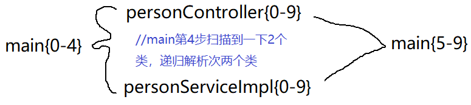

- 如下图所示，首先进入解析的只有main对应的类，main类处理到第4步，扫描出了另外两个类
- 之后就先去递归解析这两个类，这两个类都递归解析完了之后
- 在处理main5-9步，最后才总体处理完



```java
//processConfigurationClass:   
// 0 递归调用进行解析
do {
    sourceClass = this.doProcessConfigurationClass(configClass, sourceClass);
} while(sourceClass != null);

// 1简化流程
protected final ConfigurationClassParser.SourceClass doProcessConfigurationClass(...){
    
    //2 处理成员类
    this.processMemberClasses(configClass, sourceClass);
	//3 处理@PropertySource注解
    this.processPropertySource(importResource);

    //4 处理@componentScans注解
    Set<AnnotationAttributes> componentScans = 获取注解信息；
    var13 = componentScans.iterator();
        while(var13.hasNext()) {
            AnnotationAttributes componentScan = (AnnotationAttributes)var13.next();
            Set<BeanDefinitionHolder> scannedBeanDefinitions = 获取注解扫描后的类；
            
            Iterator var7 = scannedBeanDefinitions.iterator();
            while(var7.hasNext()) {
                BeanDefinitionHolder holder = (BeanDefinitionHolder)var7.next();
                //4.1 递归解析扫描后的类
                this.parse(bdCand.getBeanClassName(), holder.getBeanName());
            }
        }
    }

	//5 处理@import注解
    this.processImports(configClass, sourceClass, this.getImports(sourceClass), true);

	//6 处理@ImportResource注解
    importResource = 获取注解；
    if (importResource != null) {
        String[] resources = importResource.getStringArray("locations");
		//将注解确定的配置信息加入configClass
        for(int var22 = 0; var22 < var21; ++var22) {
            String resource = var19[var22];
            String resolvedResource = this.environment.resolveRequiredPlaceholders(resource);
            configClass.addImportedResource(resolvedResource, readerClass);
        }
    }

	//7 处理@beean注解
    Set<MethodMetadata> beanMethods = this.retrieveBeanMethodMetadata(sourceClass);
	//将注解确定的配置信息加入configClass
    Iterator var17 = beanMethods.iterator();
    while(var17.hasNext()) {
        MethodMetadata methodMetadata = (MethodMetadata)var17.next();
        configClass.addBeanMethod(new BeanMethod(methodMetadata, configClass));
    }
	
	//8 处理接口
    this.processInterfaces(configClass, sourceClass);

	//9 查看是否又父类，如果有返回父类，继续递归解析父类
    if (sourceClass.getMetadata().hasSuperClass()) {
        String superclass = sourceClass.getMetadata().getSuperClassName();
        if (superclass != null && !superclass.startsWith("java") && !this.knownSuperclasses.containsKey(superclass)) {
            this.knownSuperclasses.put(superclass, configClass);
            return sourceClass.getSuperClass();
        }
    }
    return null;
}
```