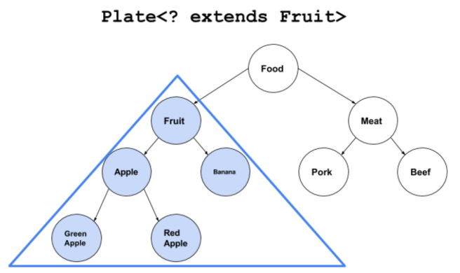
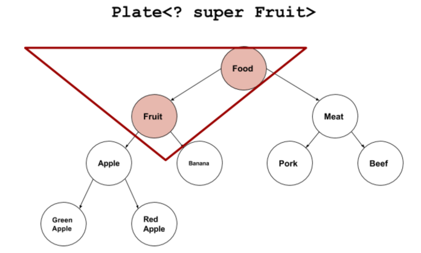

[TOC]

## 0 泛型的来源

### .基类/接口泛化思想

1. 在面向对象的编程语言中，将**方法的参数类型设为基类**，就可以利用多态的思想，使**方法能够接收**任何该基类的子类。
2. 在**类的内部也是如此**，只要是说明类型的地方，都可以用基类表示。
3. 同理类型设置为一个接口。
4. 综上，使用基类或接口可以使类更加灵活。

### ..泛型思想

1. 使代码的参数类型能够为**“某种不具体的类型”**（程序员可以随意传入任何类型，扩展性更强），而不是一个具体的类或接口（此时程序员还是必须传入某个特定的类或接口）。
2. 泛型出现的一个重要原因是为了创造容器类，通过泛型来泛化容器类[^1]的参数类型，并且一旦确定指定了某个类型，就不允许其它类型传入（编译期类型检查）。
3. **泛型的作用之一**：将运行时的错误移到编译期（如果没有泛型将容器中的Cat当作dog处理，运行时才会出错）
4.  **泛型的关键：**通过泛型可以编写更加泛化的代码（方法），这些代码（方法）能够作用更加广泛的类型（而不是特定的某个参数类）

```java
Fruit[] fruit = new Apple[10];
fruit[0] = new Apple();
fruit[1] = new AppleExtend();
//按理来说，Fruit容器肯定能装fruit对象啊，
fruit[2] = new Fruit();//编译成功，运行报：ArrayStoreException，在向数组中放置异构类型时会抛出异常

...
List<Fruit> = new ArrayList<Apple>();//这个编译就出错了！将Fruit改为Apple或将Apple改为Fruit
```


### ...泛型的限制

1. 由于到Java1.5才引入泛型的，为了能够使代码兼容以前的非泛型代码，采取了类型擦除的方案，使得编译器不能利用编译时的泛型的具体类型信息。
2. 例如，转型、intanceof、new操作不能都运用与泛型。因为运行时，泛型的类型已经被擦除

## 1 泛型的功能

### .元组类库(使用泛型类返回任意类型的多个对象)

```java
public class TwoTuple<A,B> {
    //使用private final代替 private 有两个意图
    //1.因为使用元组的意图本来就是返回多个参数，参数的引用是不会变的，所以用final修饰
    //2.这里仍然能够改变参数地址的值，如果后期使get方法返回一个深度拷贝的对象就实现了对象安全
    private final A first;
    private final B second;
    public TwoTuple(A a,B b) {first = a; second = b;}
    
    public A getFirst() {return first;}
    public B getSecond() {return second;}
}

public class ThreeTuple<A,B,C> extends TwoTuple<A,B> {
    private final C thrid;
    public ThreeTuple(A a, B b, C c) {
        super(a,b);
        thrid = c;
    }
}
```

### ..泛型类-堆栈类

```java
public class LinkedStack<T> {
    private static class Node<U> { //静态内部类不能获取泛型类的参数类型
        U item;
        Node<U> next;
        Node() {item = null; next = null;}
        Node(U item, Node<U> next) {this.item = item; this.next = next;}
        boolean end() {return item == null && next == null;}
    }
    private Node<T> top = new Node<T>();
    public void push(T item) {top = new Node<T>(item,top);}
    public T pop() {
        T result = top.item;
        if (!top.end()) top = top.next;
        return result;
    }
    public static void main() {
        LinkedStack<String> lss = new LinkedStack();
        for(String s : "Phasers on stun!".split(" ")) lss.push(s);
        String s;
        while((s = lss.pop()) != null) System.out.println(s);
    }
}
```

### ...泛型接口与迭代器

- 首先**定义接口的目的**是声明某个方法，方法可能有**返回值**
- 而泛型接口，可以是返回值为不确定的类型，如某个类的子类型(T extends Man)，这样比使用基类Man更灵活，少去了类型转换的问题。

```java
//我们定义一个泛型接口：生成器，目的是在任何实现这个接口的类中，通过这个方法生成该类实例
public interface Generator<T> {
    T next();
}
//定义了一个咖啡生成器，为了熟悉Iterator迭代器，有实现了Iterable接口
//这样就可以通过foreach语句，方便的生成咖啡类
for(Coffee c : new CoffeeGenrator(18)) {//foreach语句自动调用iterator
    drink(c);//生成18杯咖啡，18为末端哨兵
}
//等效于
Iterator<Coffee> it = new CoffeeGenrator(18).iterator();
while(it.hashNext()) {
    drink(it.next());
}
//其实刚开始定义类的时候完全不需要实现迭代器，在需要的时候，通过继承原始类得到一个ItratorCoffeeGerator类即可，这就是Iterable接口的灵活性所在。
public class CoffeeGenerator implements Generator<Coffee>, Iterable<Coffee> {

    private Class[] types = {Latte.class, Mocha.class, Cappuccino.class};
    public CoffeeGenerator() {}
    private int size = 0;//末端哨兵
    public CoffeeGenerator(int size) {
        this.size = size;
    }

    @Override
    public Coffee next() {
        try {
            return (Coffee) types[ThreadLocalRandom.current().nextInt(types.length)].newInstance();
        } catch (InstantiationException e) {
            throw new RuntimeException(e);
        } catch (IllegalAccessException e) {
            throw new RuntimeException(e);
        }
    }

    @Override
    public Iterator<Coffee> iterator() {
        return new CoffeeIterator();
    }

    class CoffeeIterator implements Iterator<Coffee> {
        int count = size;
        @Override
        public boolean hasNext() {
            return count > 0;
        }

        @Override
        public Coffee next() {
            count --;
            return CoffeeGenerator.this.next();
        }
    }
}
//通用的类型生成器
public class BasicGenerator<T> implements Generator<T> {
    private Class<T> type;

    public BasicGenerator(Class<T> type) {
        this.type = type;
    }

    @Override
    public T next() {
        try {
            return type.newInstance();
        } catch (InstantiationException e) {
            throw new RuntimeException(e);
        } catch (IllegalAccessException e) {
            throw new RuntimeException(e);
        }
    }

    public static <T> Generator<T> create(Class<T> type) {
        return new BasicGenerator<>(type);
    }
}
```

### ...泛型方法

- 到目前为止我们将的泛型都是在类上定义的泛型参数
- 同样在方法中也可以定义泛型参数，并可以返回泛型参数，不管这个类是不是泛型
- 如果使用泛型方法可以取代整个类泛型化，就尽量使用泛型方法
- 静态方法不能获取**泛型类**的参数类型


#### -定义泛型方法，必须将泛型参数列表置于返回值之前

```java
public class GenericMethods {
    public <T> void f(T t) {
        println(x.getClass().getName());
    }
    ...
    new GenericMethods().f("");
    new GenericMethods().f(1);
    ...
}
```

#### 使用泛型类时，必须声明具体的泛型参数类型，而使用泛型方法时，不需要，编译器会进行参数推到。

### ....显示的类型说明(.<String,String>)

- 必须在点操作符与方法名之间插入尖括号，类型在括号内
- 如果在该方法所在类的内部，调用该方法，必须在点操作符之前使用this关键字
- 如果时static方法，必须在点操作符之前加上类名

```java
public class New {
    public static <K,V> Map<K,V> map() {
        return new HashMap<K,V>();
    }
    public <T> List<T> list() {
        return new ArrayList<T>();
    }
    public void test() {
        New.this.<String,String>map();
        this.<String,String>map();//都行
        New.<String,String>map();//都行
        this.<String>list();
    }
}
public class Test {
    public void test() {
        New n = new New();
        n.<String>list();
        New.<String,String>map();
    }
}
```

## 2 类型擦除(与c++比较)与边界(extends a & b)定义

- 在泛型代码内部，无法获得任何有关泛型参数类型的信息——无法通过泛型参数T来创建实例
- 泛型类型只有在静态类型检查期间才出现，在此之后，泛型将被擦除，替换为非泛型上界，如List <T\>擦除为List，<T\>擦除为Object，\<T extends HasF \>擦除为HasF。

```java
#include <iostream>
using namespace std;
template<Class T> class Manipulator {
    T obj;
    public:
    	Manipulator(T x) { obj = x;}
    	//翻译成Java的话，这里就会报编译错误，cannot find symbol: method f()
    	void manipulate() {obj.f();};//这里直接使用泛型类型T来调用f()方法
};
class HasF {
    public:
    	void f() {cout << "HasF::f()" << endl;}
};
int main() {
    HasF hf;
    Manipulator<HasF> manipulator(hf);//因为编译的时候，进行了类型检查，不同与java的类型推到，这里直接是使用传进去的泛型类型，来检查的
    manipulator.manipulate();
}
HasF::f();
```

- 为了克服这个问题，使用了边界信息，来告知编译器一些信息

```java
class Manipulator<T extends HasF> {//如果不加，编译器得到的泛型信息为Object类型
    private T obj;
    public void test() {
        
    }
    public void manipulate() {obj.f();}//这里就可以使用了，因为编译器得到的泛型信息变成了HasF类型
}
```

- 编译器确保在方法或类中使用的类型的内部一致性（在类型擦除的情况下，怎么保证）——这是一个边界问题

```java
public class SimpleHolder {
    private Object obj;
    //get/set
    psvm {
        SimpleHolder holder = new SimpleHolder();
        holder.set("Item");//这里没有强制转型
        String s = (String)holder.get();//非泛型代码，是在调用get时，才转型为String的
    }
}

public class GenericHolder<T> {
    private T obj;
    public void set(T obj) {this.obj = obj;}
    public T get() {return obj;}
    psvm {
        GenericHolder<String> gh = new GenericHolder();
        gh.set("Item");
        String s = holder.get();//可以看出，源代码没有显示的转型
    }
}
//以上两个字节码是相同的，也就是说，泛型类型，编译器自动在get处加上了转型代码
```

### .使用类型标签对擦除进行补偿(补偿那些不能使用泛型T作new等的操作)

- Class\<T> type;//关键就是传入这个type属性
- return type.newInstance();//这里要注意，如果没有默认构造函数会报错，如Integer类

```java
//因为擦除导致的不能使用T作实际类型
class Erased<T extends Person> {
    public void test() {
        //T t = new T(); errordao
        T t = (T)new Person();
        String arg = "";
        //if (arg instanceof T){};error
        //T[] ts = new T[2];error

        T[] array = (T[]) new Object[1];
        T[] array1 = (T[]) new Person[1];
    }
}
class Person {}
class Building {}
class House extends Building {}
class ClassTypeCapture<T> {
    Class<T> type;//关键就是传入这个type属性
    T t;

    public ClassTypeCapture(Class<T> type) {
        this.type = type;
    }
    public boolean f(Object arg) {
        return type.isInstance(arg);
    }

    public T createInstance() {
        try {
            return type.newInstance();//这里要注意，如果没有默认构造函数会报错，如Integer类
        } catch (InstantiationException e) {
            throw new RuntimeException(e);
        } catch (IllegalAccessException e) {
            throw new RuntimeException(e);
        }
    }

    public static void main(String[] args) {
        //前后两个参数，必须完全一样，不然出错
        ClassTypeCapture<Building> ctt = new ClassTypeCapture<>(Building.class);
        ctt.f(new Building());//ture
        ctt.f(new House());//ture
        ClassTypeCapture<House> ctt1 = new ClassTypeCapture<>(House.class);
        ctt1.f(new Building());//false
        ctt1.f(new House());//ture
    }
}
```

## 3 泛型数组（通过类型标签获得泛型数组）

- 不能创建泛型数组(T[] ts = new T[])，一般用泛型的ArrayList代替
- 可以自定义一个泛型类，里面设置泛型数组
- Object[] 一般情况下是无法转换为 Integer[] 的 因为想要强制转换他们必须具有父子关系，虽然Object是所有类型的父类，但是java数组时对象，Object[] 是另外一个类了，它并不是Integer[] 的父类；
- **只有父类对象本身就是用子类new出来的时候, 才可以在将来被强制转换为子类对象**
- **如果Object[]数组只是引用指向Integer数组时**（见下面的GenericArray构造器和GenericArray1main方法），可以强制转换
- **任何类型都可以被object类型的变量所指向** 

```java
public class GenericArray<T> {
    private T[] array;

    @SuppressWarnings("unchecked")
    public GenericArray(Class<T> type, int size) {//这个例子很关键，ArrayList中的Object数组是不得已那样声明的
        array = (T[]) Array.newInstance(type,size);//这样实际类型就是type（T）了！引用指向的是Integer数组，虽然返回的是Object数组，所以后面rep可以强制转换成Integer数组。同理Object类！
    }

    public void put(int index, T item) {
        array[index] = item;
    }

    public T get(int index) {//返回的类型就是type类型
        return array[index];
    }

    public T[] rep() {return array;}//返回的就是type数组，因为创建的实际类型就是type类型

    public static void main(String[] args) {
        GenericArray<Integer> ga = new GenericArray<>(Integer.class,5);

        //integer数组可以转换为object数组，任何数组都可以转化为Object数组
        Integer[] ints = new Integer[3];
        Object[] o = new Object[3];
        o = ints;//o为integer类型了

        //object数组不可以转换为integer数组
        Object[] oo = new Object[3];
        Integer[] ints1 = new Integer[3];
        //ints1 = oo;//required Integer[] found Object[]
        
        //任何数组都可以被通过Object数组指针指向；反之不可
        GenericArray[] ge = new GenericArray[3];
        o = ge;
        
        try {
            ints1 = (Integer[])oo;//不能强转！运行时报错
        } catch (Exception e) {
            System.out.println("不能强转！");
        }

        Object a = ga.get(0);//同样成功
        Integer aa = ga.get(0);//成功，说明可以强转
        o = ga.rep();//同样
        Integer[] ia = ga.rep();//这里rep返回的还是Object类型，只能说明运行时，因为类型标签，而强转成功；因为array的实际类型就是Interger数组，才能转换。
        //Object[] 是无法转换为 Integer[] 的 因为想要强制转换他们必须具有父子关系，虽然Object是所有类型的父类，但是java数组时对象，Object[] 是另外一个类了，它并不是Integer[] 的父类
    }
}

class GenericArray0<T> {
    private T[] array;

    @SuppressWarnings("unchecked")
    public GenericArray0(int size) {
        array = (T[]) new Object[size];
    }

    public void put(int index, T item) {
        array[index] = item;
    }

    public T get(int index) {return array[index];}//这里返回的是Object

    public T[] rep() {return array;}//这里返回的是Object数组，实际类型擦除了
    public static void main(String[] args) {
        GenericArray0<Integer> ga = new GenericArray0<>(5);
        ga.put(0,1);
        //ga.get(0)返回的是Object类型 // Method get:(I)Ljava/lang/Object;
        //说明可以强转
        Integer a = ga.get(0);//这个为什么不报错！ -> 编译器自动转了checkcast#10class java/lang/Integer
        Object[] o = ga.rep();//integer[] -> object[] 成功

        try {
            Integer[] ia = ga.rep();//[Ljava.lang.Object; cannot be cast to [Ljava.lang.Integer;
        } catch (Exception e) {
            //checkcast // class "[Ljava/lang/Integer;" 上面是编译成功，转型失败
            System.out.println("因为擦除了类型信息，导致不能强转！");
        }

    }
}

class GenericArray1<T> {
    private Object[] array;
    public GenericArray1(int size) {array = new Object[size];}
    public void put(int index, T item) { array[index] = item;}
    public T get(int index) {return (T) array[index];}
    public T[] rep() {return (T[]) array;}
    public Object getObj(int index) {return array[index];}

    public static void main(String[] args) {
        GenericArray1<Integer> g1 = new GenericArray1(3);
        g1.put(0,1);
        //编译就不通过了！
        //Integer in = g1.getObj(0);//这里出问题了，证明Object不能转Integer
        Integer in = (Integer)g1.getObj(0);//说明可以强转！因为是引用指向，所以可以强转！
        Integer in1 = g1.get(0);//进一步证明可以强转，这里没出问题，说明，get方法的时候，已经转成Integer了

        Object obj = in1;//任何类型都可以被Object的变量指向
        int a = 1;
        obj = a;

        Integer[] temp = {1,2,4,6};
        Object[] objs = temp;//只是引用指向
        Integer[] ins = (Integer[]) objs;//可以强制转换

        Object[] ins1 = {1,2,4,6};//这个是赋值
        try {
            ins = (Integer[]) ins1;
        } catch (Exception e) {
            System.out.println("不能强制转换！");
        }

        try {
            Integer[] is = g1.rep();
        } catch (Exception e) {
            System.out.println("类型被参数，不能强转！");
        }
    }
}
```

## 4 通配符

- 向容器中存放元素，只能存放**最子类元素**的子类（? super Fruit：这个容器中的最子类元素为Fruit，所以能放Apple/Orange，不能放food）——关于? extends Fruit，编译器就不是到最子类是哪个了，所以不能往这个容器中放元素。
- 使用容器元素中的方法，只能使用最父类元素中的方法（因为通用）（? extends Fruit：这个容器中的最父类是Fruit，所以可以使用Fruit中的方法）——关于? super Fruit，编译器就不知道最父类是谁了，所以不能使用这种容器中的元素。

- **无论何时，只要使用了原生类型，都会放弃编译器检查** ,所以要用泛型代替原生类型

- List<？ extends Fruit> fruit = ...;
  - 有上界：这样**编译器**就知道，这个容器中的所有元素都能通用 Fruit类中的所有方法，所以随便取。
  - 没有下界：万一fruit指向的是GreenApple类，我往里面存Apple类，不就不对了嘛，所以不能存。（**编译器不能判断我存的数据是否是 fruit指向容器中元素的子类**）
- List<? super Fruit> fruit = ...;
  - 有下界：下界为Fruit，所以我可要很放心的往 fruit中，存放所有Fruit的子类。（**编译器能够判断存放的代码是否是Fruit的子类**），所以能存。
  - 没有上界：没有上界，就不知道基类。（**编译器不知道那个方法通用**），所以不能取。取出来只能赋值为Object
- 通配符主要是在方法中用，如果这个方法是**消费者**，则可以定义 参数泛型为extends。如果方法是生产者，可以定义参数泛型为 super！  SuperSet/extendsGet
- 总结通配符：
  - 无界通配符，不能set(因为编译器不知道那个类型能插入，万一插入别的类就不对啦)，get出来的是Object类型，get返回后，可能发生运行时异常（类型转换）
  - extends通配符，不能set(因为编译器不知道那个类型能插入，万一插入父类就不对啦)，get出来的就是extends的类型
  - super通配符，能set(因为编译器知道能插入super类的所有子类)，get出来的是Object类型，可能发生运行时异常

### .extends引入协变

- 因为容器的类型和容器所持有类型它们之间没有关系，泛型没有协变性（List\<Integer>不是List\<Obj>的子类）
- 那怎么能够使泛型容器具有协变特性呢
- 使用List<? extends Fruit>来修饰变量 flist，这样flist就能代表任意一个扩展自Fruit的类的列表了
- **通配符的局限**：flist初始化之后就 **不能修改**了，因为**我们不知道flist的具体类型**，所以传入任何类型都不对！
- **通配符的用处**：我们可以把这个变量传给他人消费，消费者知道里面肯定是Fruit的扩展类，并不需要知道具体类型，这样就有种多态（协变）的感觉了；我们传什么类型，它们就消费什么类型，从而执行重载的方法。



- **有上界（知道基类）**：这样**基类中的方法和属性就是容器中所有元素的通用方法和属性**，大胆的取出来用！
- **没有下界：**不知道下界，这样变量**可以指向任意下界的元素容器(List\<GreenApple\>)**，这时，如果你往这个容器中插入new Apple，显然是不对的。所以，不能查入元素。

现代编译器大多采用的是上下文无关文法（编译器：老子归约一句是一句），符号表中存储的标识符fruit是Fruit[]类型（不然咱还怎么多态），在以后的解析过程中编译器看到fruit只会认为是Fruit[]类型。 

```java
public class NonCovariantGenerics {
    //编译不通过，因为Apple的list类型不等价于Fruit的list，这里讨论的是容器的类型，而不是容器所持有的类型;泛型没有协变性（List<Integer>不是List<Obj>的子类）
    List<Fruit> flist = new ArrayList<Apple>();
}

public class GenericsAndCovariance {
    psvm {
        List<? extends Fruit> flist = Arrays.asList(new Apple(),new Orange(),new Fruit());
        flist = Arrays.asList(new Fruit(),new Fruit());
        Apple a = (Apple) flist.get(0);//运行时报错！说明只有本来是子类才能强转。可以取的。
        flist.add(new Fruit());//编译器报错，不能放！
    }
}
```

### ..super引入逆变



- **没有上界（不知道基类）**：因为不知道基类，所以**没有一个通用的方法可以在容器中的任意一个元素中使用**，所以这是不能取的（即**取出来没有意义**）；**不能get()；**——get()只能赋值为Object
- **有下界：**能放。**因为知道了下界，所以完全可以放这个下界的子类**（编译器能在编译的时候就知道是不是这个下界的子类）。而且把这个容器传给别人的时候，别人也知道这个上界是Fruit，可以随便取了。

```java
public class GenericWriting {
    static List<Apple> apples = new ArrayList<>();
    static List<Fruit> fruit = new ArrayList<>();
    
    
    static <T> void writeExact(List<T> list, T item) {list.add(item);}
    static void f1() {
        writeExact(apples,new Apple());//可以
        writeExact(apples,new AppleExtend());//也可以
        writeExact(fruit,new Apple());//可以，
        writeExact(apples,new Fruit());//编译报错，apple上界
    }
    
    static <T> void writeWildcard(List<? super T> list, T item) {list.add(item);}
    static <T> void f2() {
        writeWildcard(apples,new Apple());
        writeWildcard(fruit,new Apple());
        writeWildcard(apples,new Fruit());//编译报错
    }
}
```

### ...无界通配符 List ? 

- 因为没有界，所以它不能插入，也不能取出。只能赋值。

- 作用一：声明用Java泛型来编写代码，并且参数可以支持任意类型。弥补了List\<Object\>不能表示任意类型的缺陷，同时又解决了List原生类型可以插入许多类型的问题。List\<?\>只能代表任意一种特定类型
- 现在还没有找到实际的很关键的意义（Java编程思想中，说用于捕获转换，但不明白实际意义）

```java
public class 通配符 {}
class Wildcards {
    //这个方法，不管传什么参数，都是对的，原始类型，什么类型都能重新set
    static void rawArgs(Holder holder, Object arg) {
        Object o = holder.getValue();//只能赋值Object类型
        holder.setValue(arg);
        holder.setValue(new Wildcards());
    }
    //这个方法，因为只有get所以什么方法都是对的,唯一注意的就是转型了，而转型和泛型没有关系！
    //它接受所有类型
    static Object unboundedArg(Holder<?> holder, Object arg) {
        //holder.setValue(arg);编译出错，并不能任何值
        Object o = holder.getValue();//只能赋值Object类型
        return o;
    }
    //所有方法都是对的，因为只有get方法，只有运行时转型异常
    static <T> T exact1(Holder<T> holder) {
        T t = holder.getValue();
        return t;
    }
    //传过来的两个参数，**方法参数说明，holder元素的类型是和arg一致的，可能就想是不是只用qualified能成功，其实不对。
    //关键在于：父类的引用能指向子类，这样T为Apple时，holder完全可以为Holder<Fruit>，就holder可以为 Holder<? super Apple>
    //所以Holder<? extends T>和<?>是不能传进来的，因为不能确定里面是否都是arg的父类
    //Holder<? super T>、原生类、Holder<T>可以，因为能保证都是arg的父类
    //且返回值，编译器会自动转型为arg类型！
    //关键的思想就是在父类的引用能指向子类思想的条件下扩充条件，尽一切可能满足条件，实在不能满足那就是编译错误
    static <T> T exact2(Holder<T> holder, T arg) {
        holder.setValue(arg);
        T t = holder.getValue();
        return t;
    }
    //传过来的两个参数，**方法参数，？ extends T表示容器中的元素必须是T类型的子类。为了尽量满足它，所以可以是arg先向上转型
    //因为具体泛型类型arg可以无限转型到Object所以，T可以是Object，说明holder中的元素只要是Object类型的子类就行，所以都行
    //且返回值，编译器会自动转型为arg类型！
    //关键的思想就是在父类的引用能指向子类思想的条件下扩充条件，尽一切可能满足条件，实在不能满足那就是编译错误
    static <T> T wildSubtype(Holder<? extends T> holder, T arg) {
        //holder.setValue(arg);//编译错误，set(capture of ? extends T) cannot be applied to T
        T t = holder.getValue();
        return t;
    }
    //? super T说明了容器中的元素都必须为T类型的父类！这里就不能让T向上转型了，那会是条件更苛刻
    //这样holder只能是T的父类了，<? extends T>和<?>都不能满足
    //<? super T>、<T>能满足
    //且返回值，编译器会自动转型为arg类型！
    static <T> void wildSuperType(Holder<? super T> holder, T arg) {
        holder.setValue(arg);
        //T t = holder.getValue();//编译出错，requried T found capture of ? super T
        Object t = holder.getValue();
    }
    public static void main(String[] args) {
        rawArgstest();
        unboundedArgTest();
        exact1Test();
        exact2Test();
        wildSubtypeTest();
        wildSuperTypeTest();
    }

    //方法参数为原始类型，方法所有类型都可以接收，不报错；因为是get赋值给Object所以没错
    private static void rawArgstest() {
        //Holder raw = new Holder<Long>();//这个Long泛型是没有的，编译时只是Holder原生类
        Holder raw = new Holder();
        Holder<Long> qualified = new Holder<>();
        Holder<?> unbounded = new Holder<Long>();
        Holder<? extends Long> bounded = new Holder<>();
        Holder<? super Long> bounded0 = new Holder<>();
        Long lng = 1L;

        rawArgs(raw,lng);
        rawArgs(raw,new Wildcards());
        rawArgs(qualified,lng);
        rawArgs(unbounded,lng);
        rawArgs(bounded,lng);
        rawArgs(bounded0,lng);
    }
    private static void unboundedArgTest() {
        Holder raw = new Holder();
        Holder<Long> qualified = new Holder<>();
        Holder<?> unbounded = new Holder<Long>();
        Holder<? extends Long> bounded = new Holder<>();
        Holder<? super Long> bounded0 = new Holder<>();
        Long lng = 1L;

        //方法参数为无界通配符，是可以get的，但get出来类型就消失成object了
        raw = new Holder<>(new Wildcards());
        Wildcards w = (Wildcards) unboundedArg(raw,lng);
        unboundedArg(qualified,lng);
        unboundedArg(unbounded,lng);
        unboundedArg(bounded,lng);
    }
    private static void exact1Test() {
        Holder raw = new Holder();
        Holder<Long> qualified = new Holder<>();
        Holder<?> unbounded = new Holder<Long>();
        Holder<? extends Long> bounded = new Holder<>();
        Holder<? super Long> bounded0 = new Holder<>();
        Long lng = 1L;

        //方法参数为标准泛型，没有通配符，因为类型擦除，所以只能输出Object类型
        Object r1 = exact1(raw);
        Long r22 = exact1(qualified);//可能运行出错，因为编译器才不知道运行时的类型呢
        Object r2 = exact1(qualified);
        Object r3 = exact1(unbounded);
        //Long r4 = exact1(bounded);////可能运行出错，因为编译器才不知道运行时的类型呢
        Object r4 = exact1(bounded);
    }
    //所以Holder<? extends T>和<?>是不能传进来的，因为不能确定里面是否都是arg的父类
    //Holder<? super T>、原生类、Holder<T>可以，因为能保证都是arg的类
    private static void exact2Test() {
        Holder raw = new Holder();
        Holder<Long> qualified = new Holder<>();
        Holder<?> unbounded = new Holder<>();
        Holder<? extends Long> bounded = new Holder<>();
        Holder<? super Long> bounded0 = new Holder<>();
        Long lng = 1L;

        //方法为一般泛型类型，因为方法里有set，所以无界和没有下界的 unbounded和bounded不能set，所以报错
        Long r5 = exact2(raw,lng);
        Long r6 = exact2(qualified,lng);
        //exact2(qualified,new Wildcards());编译出错，因为类型根本就不匹配！
        //exact2(new Holder<String>(),lng);
        exact2(new Holder<>(),lng);
        exact2(new Holder<Long>(),lng);
        exact2(unbounded,lng);//编译出错，
        exact2(bounded,lng);//编译出错，

        exact2(bounded0,lng);
    }
    //所以Holder<? super T>和<?>是不能传进来的，因为不能确定里面是否都是arg的子类
    //Holder<? extends T>、原生类、Holder<T>可以，因为能保证都是arg的子类
    private static void wildSubtypeTest() {
        Holder raw = new Holder();
        Holder<Long> qualified = new Holder<>();
        Holder<?> unbounded = new Holder<>();
        Holder<? extends Long> bounded = new Holder<>();
        Holder<? super Long> bounded0 = new Holder<>();
        Long lng = 1L;

        //方法为有上界的泛型，因为没有set方法，所以任何参数都没问题，这里没报错是因为，所有的返回值都是null，所以可以转化成Long
        //但是如果赋值时，就会报错
        Long r9 = wildSubtype(raw,lng);
        Long r10 = wildSubtype(qualified,lng);
        Object r11 = wildSubtype(unbounded,lng);
        //Long r111 = wildSubtype(unbounded,lng);//当赋值Long时，编译就出错，
        Long r12 = wildSubtype(bounded,lng);//可能运行出错，因为编译器才不知道运行时的类型呢
        wildSubtype(bounded0,lng);
    }
    private static void wildSuperTypeTest() {
        Holder raw = new Holder();
        Holder<Long> qualified = new Holder<>();
        Holder<?> unbounded = new Holder<>();
        Holder<? extends Long> bounded = new Holder<>();
        Holder<? super Long> bounded0 = new Holder<>();
        Long lng = 1L;

        wildSuperType(raw,lng);
        wildSuperType(qualified,lng);
        //wildSuperType(unbounded,lng);//编译出错，
        //wildSuperType(bounded,lng);//编译出错，
        wildSuperType(bounded0,lng);
    }

//    public static void printList(List<?> list) {
//        for (Object elem: list)
//            System.out.print(elem + "");
//        System.out.println();
//    }
    public static <T> void printList(List<T> list) {
        for (T elem: list)
            System.out.print(elem + "");
        System.out.println();
    }
}
class Holder<T> {
    private T value;
    public T getValue() {
        return value;
    }
    public void setValue(T value) {
        this.value = value;
    }
    public Holder(T value) {
        this.value = value;
    }
    public Holder() {}
}
```

## 5 泛型存在的问题

### .泛型的类型不能是基本类型

- 极少数情况下自动包装机制会导致性能损耗
- 自动包装不能用于基本类型数组（int[] ints = fill(返回的是包装类型Integer[])//边缘错误！）

### ..一个类不能同时实现一个泛型接口的两种变体（因为重复实现接口（类型擦除后就是同一接口））

```java
interface Payable<T> {}
class Employee implements Payable<Employee>
//cannot be inherited with different type arguments: 'com.wangkang.test.杂.Employee' and 'com.wangkang.test.杂.Hourly'
class Hourly extends Employee implements Payable<Hourly>
```

### ...会额外产生很多转型警告，因为运行时类型擦除了，所以编译器不知道会不会转型出错

### ....擦除后的重载问题

- f(List\<T\> v)、f(List\<E\> w)不能共存

### .....基类劫持了接口（与一个类不能同时实现一个泛型接口的两种变体一个思想）

```java
public class ComparablePet implements Comparable<ComparablePet> {
    @Override
    pubilc int compareTo(ComparablePet arg) { return 0;}
}
//java.lang.Comparable' cannot be inherited with different type arguments: 'com.wangkang.test.杂.ComparablePet' and 'com.wangkang.test.杂.Cat'
class Cat extends ComparablePet implements Comparable<Cat> {
    pubilc int compareTo(Cat arg) {return 0;}
}
```

## 6 自限定类

- 以前对自定义类型非常疑惑主要是书上各种类型很多，不知道哪一种是自限定类型，所以很混乱，都不知核心是哪，怎么总结

```java
//这个参数类型T要满足T extends SelfBounded<T> 才行
class SelfBounded<T extends SelfBounded<T>>{}//SelfBounded就是自限定类型

class E {}
class B extends SelfBounded<E> {}//这样就不行,因为E不满足 T extends SelfBounded<T> 形式
class B extends SelfBounded<B> {}//可以，B满足T extends SelfBounded<T>形式

class D extends SelfBounded<D> {}
class F extends SelfBounded<D> {}//可以，因为D满足T extends SelfBounded<T> 形式

class G extends SelfBounded<F> {}//不可以，并F不满足T extends SelfBounded<T> 形式！

综上：继承SelfBounded类型的类，它的SelfBounded中的泛型参数必须是自身（只有这样才满足T extends SelfBounded<T> 条件）
```
- 自限定用于继承体系中
- 自限定类要求，继承它的类的代码必须是这种格式`class A extends SelfBounded<A>`，起强制作用

### .自限定方法

```java
public class SelfBoundingMethods {
    //说明这个参数类的定义必须满足 class T extends SelfBounded<T>这种形式
    static <T extends SelfBounded<T>> T f(T arg) {}
}
```

### ..自限定类的意义

- 产生协变参数类型——方法参数类型会随子类而变化(多态)——没搞懂

- 如果不使用自限定，将重载参数类型；使用自限定，只能获得某个方法的一个版本，它将接受确切的类型——搞不懂

```java
//-------------------------原生类型，本来就支持协变
//就是简单的继承了 set方法，且任何BascSetter子类型都行
class BascSetter {void set (BascSetter bs){
    System.out.println("bascSet");
}}
class BascExtend extends BascSetter{}
class BascExtend1 extends BascSetter{}
class BascTest {
    void test(BascSetter bs, BascExtend b, BascExtend1 b1) {
        bs.set(bs);
        bs.set(b);
        bs.set(b1);
    }
}

//标准泛型，参数可以是任何类型
class GenericSetter<T> {void set(T arg){
    System.out.println("fu");
}}
class Gsetter extends GenericSetter<Basic> {}
class Gsetter1 extends GenericSetter<Gsetter1> {}
class test{
    void test(GenericSetter gs, Gsetter g, Gsetter1 g1) {
        gs.set(new Object());
        //g.set(gs);
        g.set(null);
    }
}

//
class SelfBoundSetter<T extends SelfBoundSetter<T>> {void set(T arg) {
    System.out.println("基类");
}}
//最关键的就是：参数只能是自身
class Setter extends SelfBoundSetter<Setter> {}
class Setter2 extends SelfBoundSetter<Setter2> {}
class SetterExtend extends Setter {}
class SelfBoundingAndCovariantArg{
    void testA(Setter s1, Setter s2, SelfBoundSetter sbs,Setter2 setter2,SetterExtend se) {
        s1.set(s2);
        //set (com.wangkang.test.泛型测试.Setter) in SelfBoundSetter cannot be applied to (com.wangkang.test.泛型测试.SelfBoundSetter)
        //s1.set(sbs);
        //setter2.set(sbs);
        setter2.set(setter2);

        s1.set(se);//也可以是子类

        sbs.set(s1);
        sbs.set(s2);
        sbs.set(setter2);
    }
}

//能说明什么问题！？
interface SelfBoundSetter<T extends SelfBoundSetter<T>>{
    void set(T arg);
}
interface Setter extends SelfBoundSetter<Setter>{
    
}
public class SelfBoundingAndCovarianArguments {
    void testA(Setter s1 , Setter s2 ,SelfBoundSetter sbs) {
        s1.set(s1);
        s1.set(s2);
        // s1.set(sbs); 编译错误
    }
}
```

## 7 Collections.checkedList()方法时旧代码有运行时泛型检查

- 这个 方法返回的list，作为参数传入1.5之前的没有泛型的方法时，运行时就会检查并报错

```java
class CheckedList {
    void oldStyleMehtod (List probablyDogs) {
        probablyDogs.add(new Cat());
    }
    
    void test() {
        List<Dog> dog = collections.checkedList(new ArrayList<Dog>(),Dog.class);
        oldStyleMethod(dog);//运行时报错！
    }
}
```

## 8 潜在类型机制（鸭子类型）

```python
# py，同理c++
class Dog:
    def speak(self):
        print "Arf";
    def sit(self):
        print "Sitting";
    def reproduce(self):
        pass
class Robot:
     def speak(self):
        print "Click";
    def sit(self):
        print "Clank";
    def oilChange(self):
        pass   
def perform(anything)
	anything.speak();
    anything.sit();
    
a = Dog();b =Robot();
//只要有这个方法就行，鸭子类型
perform(a);perform(b);//如果a,b没有相应类型，运行时报错

//Java不支持鸭子类型，如果要时perform(a);perform(b);编译成功，必须借助接口或类
//把 speak和sit方法抽离出来
```

### .对缺乏潜在类型的补偿

#### -使用反射（反射将所有类型检查都转移到了运行时）

```java
public class 鸭子类型补偿 {
    public static void main(String[] args) {
        perform(new SmartDog());
        perform(new Cat());
        //perform(new Mime());
    }
}

class Mime {
    public void walk(){}
    public void sit(){
        System.out.println("Pretending to sit");
    }
    public void push(){}
    public String toString(){return "Mime";}
}

class SmartDog {
    public void speak(){
        System.out.println("woof!");
    }
    public void sit(){
        System.out.println("sitting");
    }
    public void reproduce(){}
}

class Cat {
    public void speak(){
        System.out.println("cat!");
    }
    public void sit(){
        System.out.println("catSitting");
    }
    public void reproduce(){}
}

class Communicate {
    public static void perform(Object speaker) {
        Class<?> spkr = speaker.getClass();

        Method speak = null;
        Method sit = null;
        try {
            speak = spkr.getMethod("speak");
            sit = spkr.getMethod("sit");
        } catch (NoSuchMethodException e) {
            e.printStackTrace();
        }

        try {
            sit.invoke(speaker);
            speak.invoke(speaker);
        } catch (IllegalAccessException e) {
            e.printStackTrace();
        } catch (InvocationTargetException e) {
            e.printStackTrace();
        }
    }
}
```


## 参考

Java编程思想

[? extends T 和 ? super T](https://www.cnblogs.com/drizzlewithwind/p/6100164.html)

https://www.jianshu.com/p/2bf15c5265c5

https://www.cnblogs.com/tianweijiang/p/5668441.html

## 待读进阶参考

《Generics in the Java Programming Language》

《Java Generics FAQs》

《Adding Wildcards to the Java Programming Language》


[^1]: 容器可以存储任何类型，而不是只能是某个或多个特定的类型

