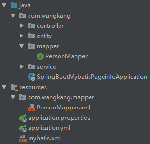
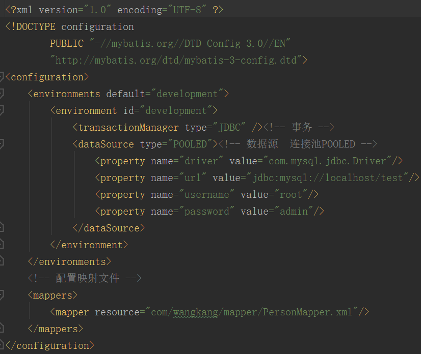
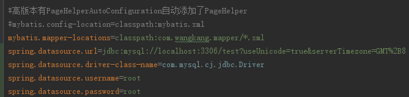

[TOC]

## 0 Mybatis简介

- Mybatis是一个持久层框架，它替代了开发人员编写原生Jdbc连接中的绝大部分重复工作。

## 1 原生Jdbc操作流程

1. 注册数据库驱动
2. 获取数据库连接
3. 通过制定的sql进行预编译
4. 设置预编译参数
5. 执行预编译sql，并返回结果
6. 将结果定制化的映射到对应的Java对象中
7. 关闭各种资源
8. 异常捕获

```java
//这里很多代码可以抽离出来，作为数据库连接的静态工具
//但是仍然比较繁琐，且没有统一的标准
//这里做出了最繁琐的代码
public void insertUser(String name, String sex, float salary) {
    String driver = "com.mysql.jdbc.Driver";
    String url = "jdbc:mysql://127.0.0.1:3306/mydb2";
    String user = "root";
    String password = "root";
    String sql = "insert into user(name,gender,salary) values(?,?,?)";
    Connection conn = null;
    PreparedStatement pstmt = null;
    ResultSet rs = null;
    try {
        //注册数据库驱动
        Class.forName(driver);										//1
        //取得数据库连接
        conn = DriverManager.getConnection(url, user, password);	  //2
        //进行预编译，这里进行参数设置
        pstmt = conn.prepareStatement(sql);							//3
        pstmt.setString(1,name);
        pstmt.setString(2,sex);
        pstmt.setFloat(3,salary);										//4
        //进行编译
        rs = pstmt.executeQuery();									//5
        while (rs.next()) {
            int id = rs.getInt("id");
            String name = rs.getString("name");
            String gender = rs.getString("gender");
            float salary = rs.getFloat("salary");
            System.out.println(id + ":" + name + ":" + gender + ":"+ salary);
        }
    } catch (Exception e) {
        e.printStackTrace();
    } finally {
        if(rs!=null){//轻量级，创建和销毁rs所需要的时间和资源较小
            try {
                rs.close();
            } catch (Exception e) {
                e.printStackTrace();
            }
        }
        if(stmt!=null){//轻量级，创建和销毁rs所需要的时间和资源较小
            try {
                stmt.close();
            } catch (Exception e) {
                e.printStackTrace();
            }
        }
        if(conn!=null){//重量级，创建和销毁rs所需要的时间和资源较小
            try {
                conn.close();
            } catch (Exception e) {
                e.printStackTrace();
            }
        }
    }
}

```

### 原生Jdbc操作的缺点

- 繁琐，每个Jdbc操作都要写许多与业务无关的代码
- 与业务耦合性高

## 2 Spring+Mybatis数据库操作流程

1. 配置mybatis的配置文件（mybatis会将这个配置文件中的信息全部映射到**最关键**的**Configuration类中**）
2. 编写mapper接口
3. 编写mapper接口对应的mapper.xml文件(2、3两步中的代码可以很简单、快速的通过mybatis-generator自动生成!)
4. 所以整个流程仅仅是：配置mybatis配置文件（这个配置信息也很简单（因为Configuration类中就那么几个属性，并且常用的属性就更少了））

！

上图为整合mybatis的项目结构。

- 其中java下的mapper包和resources下的mapper包都是通过mybatis-generator自动生成的
- 下图为mybatis.xml里的配置内容，可以看出配置及其简单，在springboot中通常通过yml或.properties文件文件配置来替代.xml文件配置



- .properties配置文件形式如下，和xml文件内容（值并不一样，因为不是一个项目）是对应的（配置Configuration类中的属性是一样的），只不过是换了一种表达形式



```java
//正真的业务代码就是这么简单
//这是service包中某个类的某个方法
//数据库操作仅仅是一行——personMapper.insert(user);
private UserMapper userMapper;//这个Spring初始化的时候装配好了
public void insertUser(String name, String sex, float salary) {
    User user = new User(name,sex,salary);
	userMapper.insert(user);//仅仅是调用了自动生成代码的相关接口，这里调用的是代理类 
}
```

## 3 mybatis重要组件（类）

- **Configuration**，Mybatis所有配置信息，最后都会映射到这个类中
- **SqlSession**，这个算是一个比较顶层的API了，通过这个的得到mapper接口，而开发人员调用的就是mapper接口，来实现数据库操作的

```java
//在不是spring的项目中
public void insertUser(...) {
    //和Spring的区别就是，spring的userMapper是自动注入的
    //这是个伪代码
    UserMapper userMapper = sessionFactory.openSession().getMapper(UserMapper.class);
    userMapper.insertUser(...);
}
//这个getSessionFactory是返回一个sqlSessionFactory类，这个类就是通过mybatis配置文件初始化的
//这是个伪代码
String resource = "mybatis.xml"；
sessionFactory = new SqlSessionFactoryBuilder().build(Resources.getResourceAsReader(resource));

//每个SqlSessionFactory对应一个数据源dataSource，这样可以设置不同的SqlSessionFactory来指定不同的数据源（多数据源分离）
@Bean(name = "test2SqlSessionFactory")
public SqlSessionFactory testSqlSessionFactory(@Qualifier("test2DataSource") DataSource dataSource) throws Exception {
    SqlSessionFactoryBean bean = new SqlSessionFactoryBean();
    bean.setDataSource(dataSource);//
    bean.setMapperLocations(new PathMatchingResourcePatternResolver().getResources("classpath:mybatis/mapper/test2/*.xml"));
    return bean.getObject();
}

//每个事务管理器也对应一个数据源dataSource
@Bean(name = "test2TransactionManager")
public DataSourceTransactionManager testTransactionManager(@Qualifier("test2DataSource") DataSource dataSource) {
    return new DataSourceTransactionManager(dataSource);
}
```

- **Executor**

MyBatis执行器，是MyBatis 调度的核心，负责SQL语句的生成和查询缓存的维护

- **StatementHandler**

封装了JDBC Statement操作，负责对JDBC statement 的操作，如设置参数、将Statement结果集转换成List集合。

- **ParameterHandler** 

负责对用户传递的参数转换成JDBC Statement 所需要的参数，

- **ResultSetHandler**

负责将JDBC返回的ResultSet结果集对象转换成List类型的集合；

- **TypeHandler**

 负责java数据类型和jdbc数据类型之间的映射和转换

- **MappedStatement**

 MappedStatement维护了一条<select|update|delete|insert>节点的封装，

- **SqlSource**

负责根据用户传递的parameterObject，动态地生成SQL语句，将信息封装到BoundSql对象中，并返回

- **BoundSql**

表示动态生成的SQL语句以及相应的参数信息

## [myBatis源码分析](./mybatis源码分析.md)

## 参考


[Java操作数据库之jdbc【原生方式】](https://blog.csdn.net/xiaozhegaa/article/details/70208646)