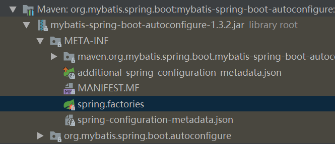
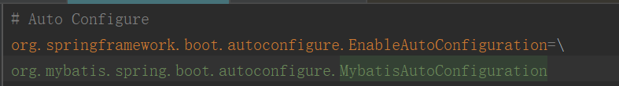

在`springboot`中引入如下依赖，`spring`会自动配置、注入`mybatis`的相关属性

```java
<dependency>
   <groupId>org.mybatis.spring.boot</groupId>
   <artifactId>mybatis-spring-boot-starter</artifactId>
   <version>1.3.2</version>
</dependency>
```

`spring`会自动加载引入`jar`包中的`spring.factories`文件中类。实现类： SpringFactoriesLoader （类似与Java SPI机制的一个加载类）



`spring.factories`中定义了`mybatisAutoConfiguration`配置类



如下为`MybatisAutoConfiguration`配置类

```java
@Configuration
@ConditionalOnClass({SqlSessionFactory.class, SqlSessionFactoryBean.class})//项目中要有这两个类
@ConditionalOnBean({DataSource.class})//容器中要注入了dataSource类
@EnableConfigurationProperties({MybatisProperties.class})//注入mybatis属性
@AutoConfigureAfter({DataSourceAutoConfiguration.class})//先配置DataSource
public class MybatisAutoConfiguration {
    private final MybatisProperties properties;//这个在MybatisProperties.class中解析了

    @Bean
    @ConditionalOnMissingBean
    //如果自己配置了SqlSessionFactory类，就不加载这个类了
    public SqlSessionFactory sqlSessionFactory(DataSource dataSource){...}
    @Bean
    @ConditionalOnMissingBean
    //如果自己配置了SqlSessionTemplate类，就不加载这个类了
    //相当于SqlSession sqlSession = sqlSessionFactory.openSession();
    public SqlSessionTemplate sqlSessionTemplate(SqlSessionFactory sqlSessionFactory){...}
}
```


